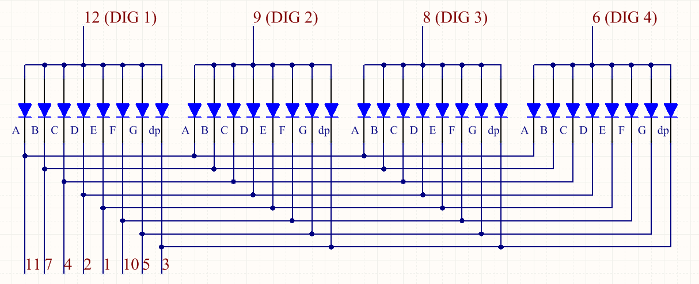

.. note::

    你好，欢迎来到 SunFounder 树莓派、Arduino 和 ESP32 爱好者社区的 Facebook 页面！与其他爱好者一起深入探讨树莓派、Arduino 和 ESP32。

    **为什么加入？**

    - **专家支持**: 通过我们的社区和团队的帮助解决售后问题和技术挑战。
    - **学习与分享**: 交流技巧和教程，提升你的技能。
    - **独家预览**: 提前了解新产品发布和预告。
    - **特别折扣**: 尊享我们最新产品的专属折扣。
    - **节日促销和赠品**: 参与赠品活动和节日促销。

    👉 准备好与我们一起探索和创造了吗？点击 [|link_sf_facebook|] 加入我们吧！

.. _4-digit:

4 位 7 段数码管
==================================

4 位 7 段数码管由四个协同工作的 7 段数码管组成。

.. image:: img/4-digit-sche.png

4 位 7 段数码管独立工作。它利用人类视觉暂留的原理，将每个7段的字符快速循环显示，形成连续的字符串。

例如，当数码管显示“1234”时，第一个7段显示“1”，不显示“234”。一段时间后，第2个7段显示“2”，第1个第3个第4个7段不显示，以此类推，四位数码管依次显示。这个过程很短（一般为5ms），而且由于光学余辉效应和视觉残留原理，我们可以同时看到四个字符。

**显示代码**

为了帮助你了解7段式数码管（共阳极）如何显示数字，我们绘制了下表。数字是7段数码管上显示的数字0-F；(DP) GFEDCBA是指对应的LED设置为0或1，例如11000000表示DP和G设置为1，其他则设置为0，因此在7段数码管上显示数字0，而HEX Code对应的是十六进制数。

.. image:: img/common_anode.png

**示例**

* :ref:`stopwatch_mega` (Mega板项目)
* :ref:`stopwatch_uno` （R3板项目）

