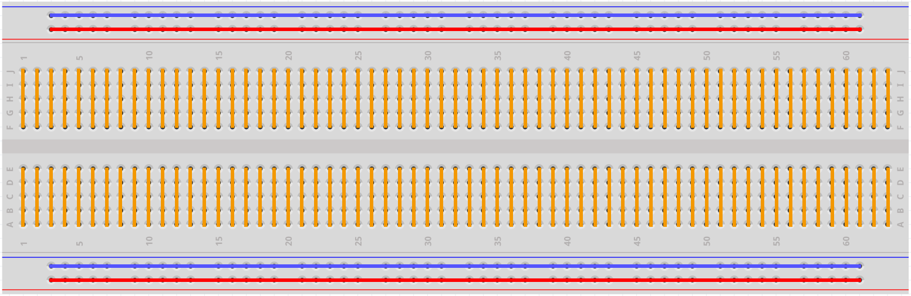

.. note::

    你好，欢迎来到 SunFounder 树莓派、Arduino 和 ESP32 爱好者社区的 Facebook 页面！与其他爱好者一起深入探讨树莓派、Arduino 和 ESP32。

    **为什么加入？**

    - **专家支持**: 通过我们的社区和团队的帮助解决售后问题和技术挑战。
    - **学习与分享**: 交流技巧和教程，提升你的技能。
    - **独家预览**: 提前了解新产品发布和预告。
    - **特别折扣**: 尊享我们最新产品的专属折扣。
    - **节日促销和赠品**: 参与赠品活动和节日促销。

    👉 准备好与我们一起探索和创造了吗？点击 [|link_sf_facebook|] 加入我们吧！

面包板
==============

.. image:: img/breadboard.png
    :width: 600

面包板是电子产品原型的构建基础。这个词最初指的是字面面包板，一种用于切片面包的抛光木头。 [1] 在 1970 年代，无焊面包板（又名插件板，终端阵列板）问世，如今术语“面包板”通常用于指代这些。

它用于在完成任何电路设计之前快速构建和测试电路。它有许多孔，可以插入上述组件，如IC和电阻器以及跳线。面包板允许你轻松插入和移除组件。

图为面包板的内部结构。虽然面包板上的这些孔看起来是相互独立的，但它们内部实际上是通过金属条相互连接的。

如果你想了解更多关于面包板的信息，请参考： `How to Use a Breadboard - Science Buddies <https://www.sciencebuddies.org/science-fair-projects/references/how-to-use-a-breadboard#pth-smd>`_

