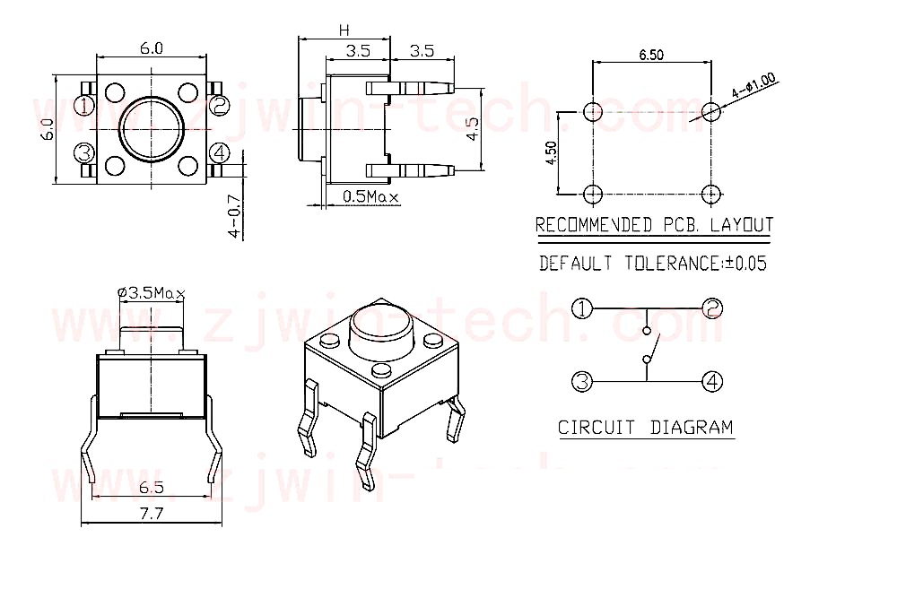

.. note::

    你好，欢迎来到 SunFounder 树莓派、Arduino 和 ESP32 爱好者社区的 Facebook 页面！与其他爱好者一起深入探讨树莓派、Arduino 和 ESP32。

    **为什么加入？**

    - **专家支持**: 通过我们的社区和团队的帮助解决售后问题和技术挑战。
    - **学习与分享**: 交流技巧和教程，提升你的技能。
    - **独家预览**: 提前了解新产品发布和预告。
    - **特别折扣**: 尊享我们最新产品的专属折扣。
    - **节日促销和赠品**: 参与赠品活动和节日促销。

    👉 准备好与我们一起探索和创造了吗？点击 [|link_sf_facebook|] 加入我们吧！

按键
==========

.. image:: img/button.png
    :width: 400
    :align: center

按键是用于控制电子设备的常见组件, 它们通常用作连接或断开电路的开关。

下面是一个按钮的内部结构。右下方的符号通常用于表示电路中的按钮。

.. image:: img/button_symbol.png
    :width: 400
    :align: center

由于引脚1连接到引脚2，引脚3连接到引脚4，当按下按键时，4个引脚连接，从而关闭电路。

**示例**

* :ref:`button_mega` (Mega板项目)
* :ref:`answer_mega` (Mega板项目)
* :ref:`button_uno` （R3板项目）
* :ref:`answer_uno` （R3板项目）
* :ref:`7. 门铃` （Scratch项目）
* :ref:`15. 游戏 - 吃苹果` （Scratch项目）

