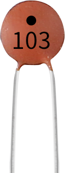

.. note::

    你好，欢迎来到 SunFounder 树莓派、Arduino 和 ESP32 爱好者社区的 Facebook 页面！与其他爱好者一起深入探讨树莓派、Arduino 和 ESP32。

    **为什么加入？**

    - **专家支持**: 通过我们的社区和团队的帮助解决售后问题和技术挑战。
    - **学习与分享**: 交流技巧和教程，提升你的技能。
    - **独家预览**: 提前了解新产品发布和预告。
    - **特别折扣**: 尊享我们最新产品的专属折扣。
    - **节日促销和赠品**: 参与赠品活动和节日促销。

    👉 准备好与我们一起探索和创造了吗？点击 [|link_sf_facebook|] 加入我们吧！

电容
=============

.. image:: img/10uf_cap.png

电容，是指在给定电位差下所储存的电荷量，记为C，国际单位为法拉（F）。一般来说，电荷在电场中受力移动。当导体之间存在介质时，电荷的运动受到阻碍，电荷在导体上积聚，导致电荷积聚。

存储的电荷量称为电容。由于电容器是电子设备中应用最广泛的电子元件之一，因此广泛应用于直流隔离、耦合、旁路、滤波、调谐回路、能量转换、控制电路等。电容器分为电解电容器、固态电容器等。

根据材料特性，电容器可分为：铝电解电容器、薄膜电容器、钽电容器、陶瓷电容器、超级电容器等。

* `陶瓷电容器 - 维基百科 <https://en.wikipedia.org/wiki/Ceramic_capacitor>`_

* `电解电容器 - 维基百科 <https://en.wikipedia.org/wiki/Electrolytic_capacitor>`_

陶瓷电容上有103或104的标签，代表电容值，103=10x10^3pF，104=10x10^4pF

**单位换算**

    1F=10^3mF=10^6uF=10^9nF=10^12pF

**示例**

* :ref:`doorbell_mega` (Mega板项目)
* :ref:`doorbell_uno` （R3板项目）
* :ref:`7. 门铃` (Scratch项目)
* :ref:`15. 游戏 - 吃苹果` (Scratch项目)

