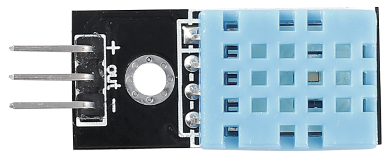
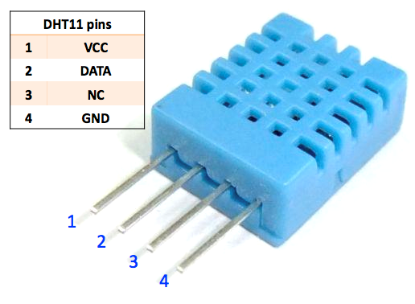

.. note::

    你好，欢迎来到 SunFounder 树莓派、Arduino 和 ESP32 爱好者社区的 Facebook 页面！与其他爱好者一起深入探讨树莓派、Arduino 和 ESP32。

    **为什么加入？**

    - **专家支持**: 通过我们的社区和团队的帮助解决售后问题和技术挑战。
    - **学习与分享**: 交流技巧和教程，提升你的技能。
    - **独家预览**: 提前了解新产品发布和预告。
    - **特别折扣**: 尊享我们最新产品的专属折扣。
    - **节日促销和赠品**: 参与赠品活动和节日促销。

    👉 准备好与我们一起探索和创造了吗？点击 [|link_sf_facebook|] 加入我们吧！

温湿度传感器模块
=============================

数字温湿度传感器 DHT11 是一种复合传感器，包含经过校准的温湿度数字信号输出。采用专用数字模块采集技术和温湿度传感技术，确保产品具有高可靠性和优异的长期稳定性。

只有三个引脚可供使用：VCC、GND 和 DATA。通信过程开始于DATA线向DHT11发送启动信号，DHT11接收信号并返回应答信号。然后主机收到应答信号，开始接收40位温湿度数据（8位湿度整数+8位湿度小数+8位温度整数+8位温度小数+8位校验和）。

* `DHT11 数据表 <https://components101.com/sites/default/files/component_datasheet/DHT11-Temperature-Sensor.pdf>`_

**示例**

* :ref:`humi_mega` (Mega板项目)
* :ref:`humi_uno` （R3板项目）
* :ref:`11. 读取温湿度` （Scratch项目）
