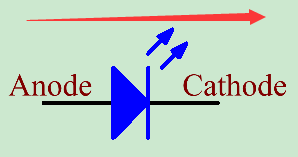

.. note::

    你好，欢迎来到 SunFounder 树莓派、Arduino 和 ESP32 爱好者社区的 Facebook 页面！与其他爱好者一起深入探讨树莓派、Arduino 和 ESP32。

    **为什么加入？**

    - **专家支持**: 通过我们的社区和团队的帮助解决售后问题和技术挑战。
    - **学习与分享**: 交流技巧和教程，提升你的技能。
    - **独家预览**: 提前了解新产品发布和预告。
    - **特别折扣**: 尊享我们最新产品的专属折扣。
    - **节日促销和赠品**: 参与赠品活动和节日促销。

    👉 准备好与我们一起探索和创造了吗？点击 [|link_sf_facebook|] 加入我们吧！

LED发光二极管
================

.. image:: img/LED.png
    :width: 400

半导体发光二极管是一种可以通过PN结将电能转化为光能的元件。按波长可分为激光二极管、红外发光二极管和通常称为发光二极管（LED）的可见光发光二极管。

二极管具有单向导电性，因此电流将如图电路符号中的箭头所示。你只能为阳极提供正电源，为阴极提供负电源。因此 LED 将亮起。

LED 有两个引脚。较长的是阳极，较短的是阴极。注意不要接反。LED 有固定的正向压降，因此不能直接与电路连接，因为电源电压会超过这个压降而导致 LED 被烧毁。红黄绿LED的正向电压为1.8V，白的为2.6V，大多数LED最大能承受20mA的电流，所以需要串联一个限流电阻。

电阻值的计算公式如下：

R = (Vsupply – VD)/I

R代表限流电阻的阻值，Vsupply代表电压供应，VD代表压降，I代表LED的工作电流。

下面是 LED 的详细介绍： `LED - 维基百科 <https://en.wikipedia.org/wiki/Light-emitting_diode>`_。

**示例**

* :ref:`blinking_mega` (Mega板项目)
* :ref:`potentiometer_mega` (Mega板项目)
* :ref:`blinking_uno` （R3板项目）
* :ref:`potentiometer_uno` （R3板项目）
* :ref:`2. 台灯` （Scratch项目）
* :ref:`3. 呼吸灯` （Scratch项目）

