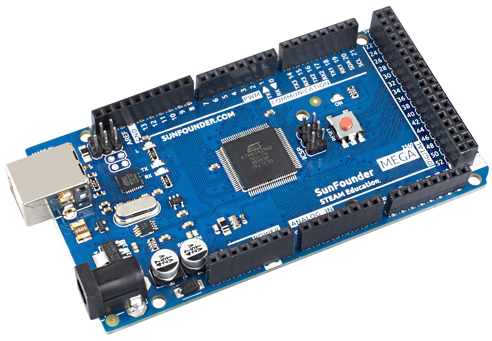
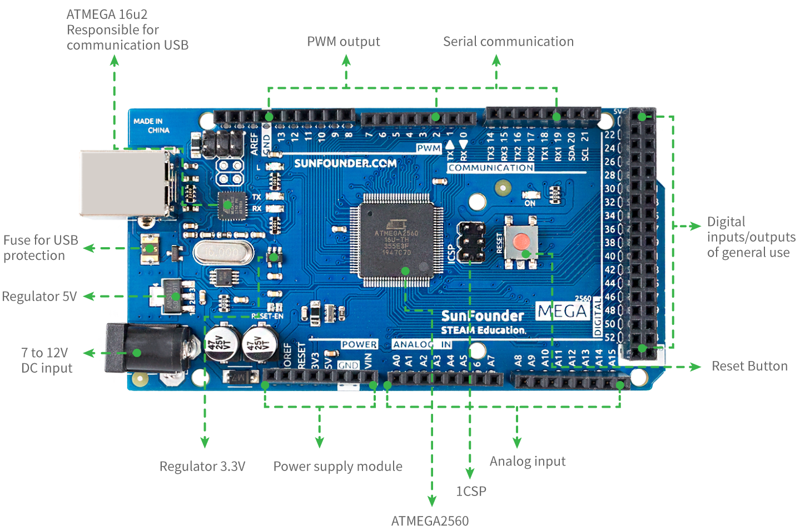

.. note::

    你好，欢迎来到 SunFounder 树莓派、Arduino 和 ESP32 爱好者社区的 Facebook 页面！与其他爱好者一起深入探讨树莓派、Arduino 和 ESP32。

    **为什么加入？**

    - **专家支持**: 通过我们的社区和团队的帮助解决售后问题和技术挑战。
    - **学习与分享**: 交流技巧和教程，提升你的技能。
    - **独家预览**: 提前了解新产品发布和预告。
    - **特别折扣**: 尊享我们最新产品的专属折扣。
    - **节日促销和赠品**: 参与赠品活动和节日促销。

    👉 准备好与我们一起探索和创造了吗？点击 [|link_sf_facebook|] 加入我们吧！

SunFounder Mega板
==============================

.. note::

    SunFounder Mega板是一块与 `Arduino Mega 2560 Rev3 <https://store-usa.arduino.cc/products/arduino-mega-2560-rev3?selectedStore=us>`_ 功能几乎相同的主板，两块板可以互换使用。

SunFounder Mega Board 是基于 ATmega2560（ `数据表 <http://ww1.microchip.com/downloads/en/DeviceDoc/ATmega640-1280-1281-2560-2561-Datasheet-DS40002211A.pdf>`_）的微控制器板。它具有 54 个数字输入/输出引脚（其中 15 个可用作 PWM 输出）、16 个模拟输入、4 个 UART（硬件串行端口）、一个 16 MHz 晶体振荡器、一个 USB 连接、一个电源插孔、一个 ICSP 接头、和一个重置按钮。它包含支持微控制器所需的一切；只需使用 USB 电缆将其连接到计算机或使用 AC-DC 适配器或电池为其供电即可开始使用。SunFounder Mega Board 板与大多数为 Uno 和之前的板 Duemilanove 或 Diecimila 设计的防护板兼容。

**技术参数**

* 微控制器：ATmega2560
* 工作电压：5V
* 输入电压（推荐）：7-12V
* 输入电压（限制）：6-20V
* 数字I/O引脚 54 (0-53, 其中15提供PWM输出(2-13, 44-46))
* 模拟输入引脚：16 (A0-A15)
* 每个 I/O 引脚的直流电流：20 mA
* 3.3V 引脚的直流电流：50 mA
* 闪存：256 KB，其中 8 KB 由引导加载程序使用
* SRAM：8 KB
* EEPROM：4 KB
* 时钟速度：16 MHz
* 内置LED: 13
* 长度：101.52 毫米
* 宽度：53.3 毫米
* 重量：37 克
* I2C端口：A4(SDA)、A5(SCL)；20(SDA), 21(SCL)

**更多**

* `Arduino IDE <https://www.arduino.cc/en/software>`_
* `Arduino编程参考 <https://www.arduino.cc/reference/en/>`_
* :ref:`安装和介绍Arduino IDE`
* `ATmega2560数据表 <http://ww1.microchip.com/downloads/en/DeviceDoc/ATmega640-1280-1281-2560-2561-Datasheet-DS40002211A.pdf>`_