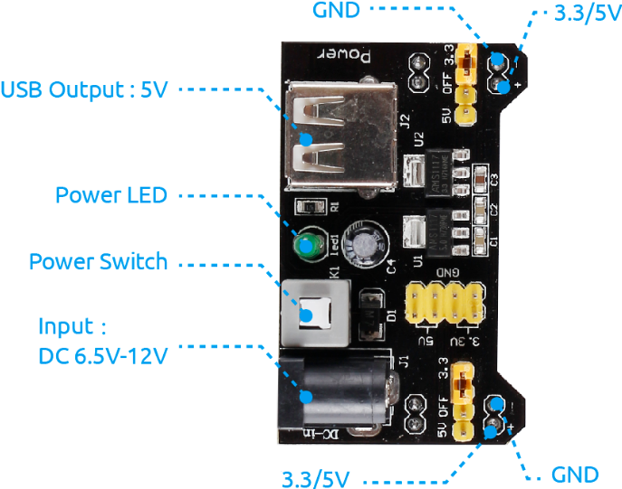

.. note::

    你好，欢迎来到 SunFounder 树莓派、Arduino 和 ESP32 爱好者社区的 Facebook 页面！与其他爱好者一起深入探讨树莓派、Arduino 和 ESP32。

    **为什么加入？**

    - **专家支持**: 通过我们的社区和团队的帮助解决售后问题和技术挑战。
    - **学习与分享**: 交流技巧和教程，提升你的技能。
    - **独家预览**: 提前了解新产品发布和预告。
    - **特别折扣**: 尊享我们最新产品的专属折扣。
    - **节日促销和赠品**: 参与赠品活动和节日促销。

    👉 准备好与我们一起探索和创造了吗？点击 [|link_sf_facebook|] 加入我们吧！

电源模块
=====================

当我们需要大电流来驱动某个组件时，会严重干扰主板的正常工作。因此，我们通过该模块单独为组件供电，使其运行安全稳定。

你只需将其插入面包板即可供电。它提供 3.3V 和 5V 的电压，你可以通过随附的跳线帽进行连接。

**特性和规格**

* 输入电压：6.5 - 12V
* 两个独立通道
* 输出电压：5V、3.3V（可通过跳线帽调节，0V、3.3V和5V配置）
* 输出电流：最大输出电流700mA
* 板载公头排针，用于 GND、5V、3.3V 输出
* ON-OFF 开关可用。
* USB (Type-A) 输入可用。
* 直流公头排针输入可用。
* 板载电源 LED
* 尺寸：53mm x 33mm（长 x 宽）

