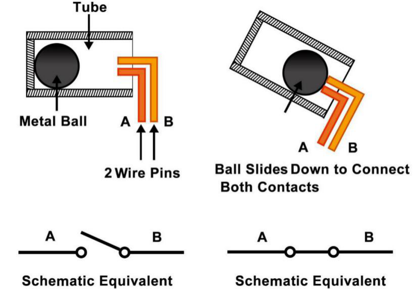

.. note::

    你好，欢迎来到 SunFounder 树莓派、Arduino 和 ESP32 爱好者社区的 Facebook 页面！与其他爱好者一起深入探讨树莓派、Arduino 和 ESP32。

    **为什么加入？**

    - **专家支持**: 通过我们的社区和团队的帮助解决售后问题和技术挑战。
    - **学习与分享**: 交流技巧和教程，提升你的技能。
    - **独家预览**: 提前了解新产品发布和预告。
    - **特别折扣**: 尊享我们最新产品的专属折扣。
    - **节日促销和赠品**: 参与赠品活动和节日促销。

    👉 准备好与我们一起探索和创造了吗？点击 [|link_sf_facebook|] 加入我们吧！

倾斜开关
=============================

.. image:: img/tilt_switch.png
    :width: 80
    :align: center

这里使用的倾斜开关是里面有一个金属球。它用于检测小角度的倾斜度。

原理很简单。当开关倾斜​​一定角度时，里面的小球滚下来，接触到外面的引脚所连接的两个触点，从而触发电路。否则球将远离触点，从而断开电路。

* `SW520D 倾斜开关数据表 <https://www.tme.com/Document/f1e6cedd8cb7feeb250b353b6213ec6c/SW-520D.pdf>`_

**示例**

* :ref:`tilt_mega` (Mega板项目)
* :ref:`tilt_uno` （R3板项目）
* :ref:`8. 不倒翁` (Scratch项目)
