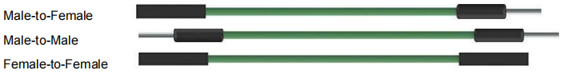

.. note::

    你好，欢迎来到 SunFounder 树莓派、Arduino 和 ESP32 爱好者社区的 Facebook 页面！与其他爱好者一起深入探讨树莓派、Arduino 和 ESP32。

    **为什么加入？**

    - **专家支持**: 通过我们的社区和团队的帮助解决售后问题和技术挑战。
    - **学习与分享**: 交流技巧和教程，提升你的技能。
    - **独家预览**: 提前了解新产品发布和预告。
    - **特别折扣**: 尊享我们最新产品的专属折扣。
    - **节日促销和赠品**: 参与赠品活动和节日促销。

    👉 准备好与我们一起探索和创造了吗？点击 [|link_sf_facebook|] 加入我们吧！

跳线
==================

连接两个端子的导线称为跳线。有各种类型的跳线。在这里，我们专注于面包板中使用的那些。其中，它们用于将电信号从面包板上的任何位置传输到微控制器的输入/输出引脚。

跳线是通过将它们的“末端连接器”插入面包板中提供的插槽来安装的，在面包板的表面下方有几组平行板，根据区域以行或列的形式连接插槽。“末端连接器”插入面包板，无需焊接，位于特定原型中需要连接的特定插槽中。

跳线有母对母（F-F）、公对公(M-M)、公对母(M-F)三种。我们之所以称其为“公对母”，是因为它的一端具有突出的尖端以及下沉的母端。公-公表示两端都是公头，而母-母表示两端都是母头。

.. note::

    * 在一个项目中可能会使用不止一种类型。
    * 跳线的颜色不同，但并不代表它们的功能也相应不同；它只是为了更好地识别每个电路之间的连接而设计的。