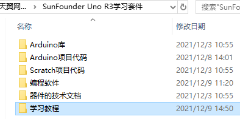

.. note::

    你好，欢迎来到 SunFounder 树莓派、Arduino 和 ESP32 爱好者社区的 Facebook 页面！与其他爱好者一起深入探讨树莓派、Arduino 和 ESP32。

    **为什么加入？**

    - **专家支持**: 通过我们的社区和团队的帮助解决售后问题和技术挑战。
    - **学习与分享**: 交流技巧和教程，提升你的技能。
    - **独家预览**: 提前了解新产品发布和预告。
    - **特别折扣**: 尊享我们最新产品的专属折扣。
    - **节日促销和赠品**: 参与赠品活动和节日促销。

    👉 准备好与我们一起探索和创造了吗？点击 [|link_sf_facebook|] 加入我们吧！

下载资料
========================

我们已经将所有相关的资料都已经上传到天翼云盘，下面是链接和访问码, 进去之后根据需要选择相应的压缩包进行下载。

* :download:`SunFounder Uno R3学习套件资料下载 <https://cloud.189.cn/web/share?code=vaMv6zYv2eYn>`

* （访问码：nn2y）

下载并解压后，你会看到以下文件夹：

* **Arduino库** ：包含了4个需要单独添加到Arduino IDE的库，在章节 :ref:`添加库` 中会用到。
* **Arduino项目代码**：包含了23个Arduino项目的代码文件，适用于 :ref:`Arduino项目 - Uno R3` 和 :ref:`Arduino项目 -  Mega2560` 章节。
* **Scratch项目代码**：包含了19个Scratch项目的代码和图片，适用于 :ref:`Scratch项目` 章节。
* **编程软件**：包含了 **Arduino IDE** 和 **PictoBlox** 在不同系统的安装包。
* **器件的技术文档**：在你想要深入了解某个器件时，你可以到这个文件夹学习器件的专业技术资料。
* **参考电子书**：提供的是其他相关的电子书，仅供参考。
* **xxx套件说明书**：这是整个套件PDF版本的说明书，无法保证是最新版，建议以在线教程以准。
