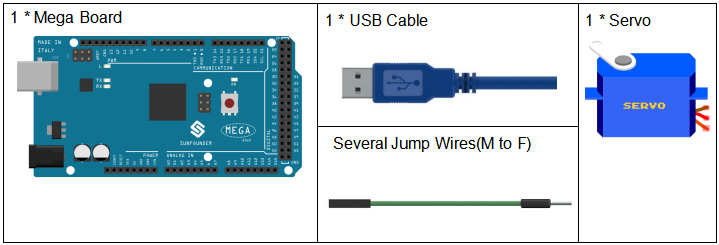
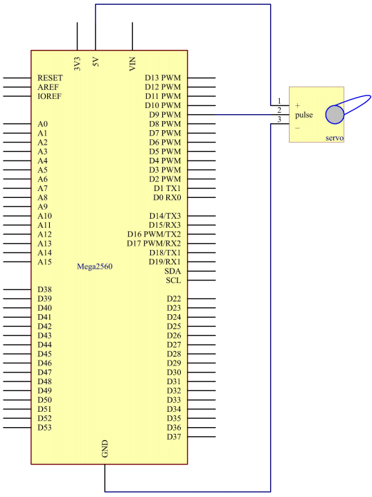
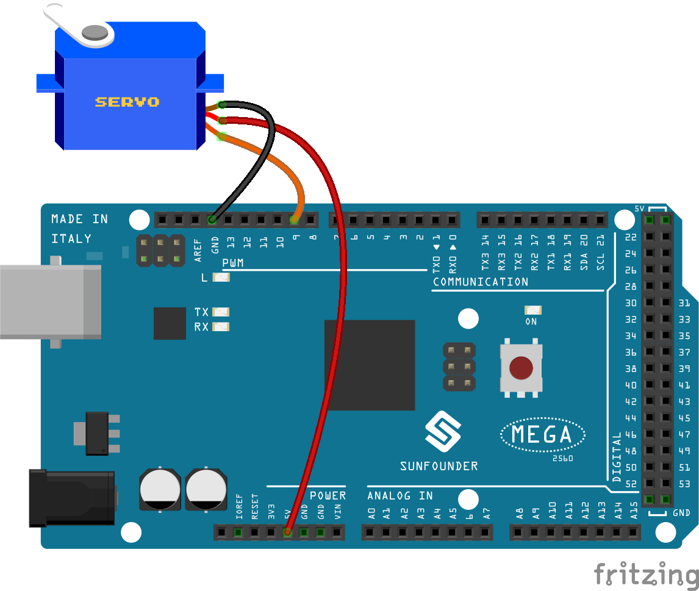
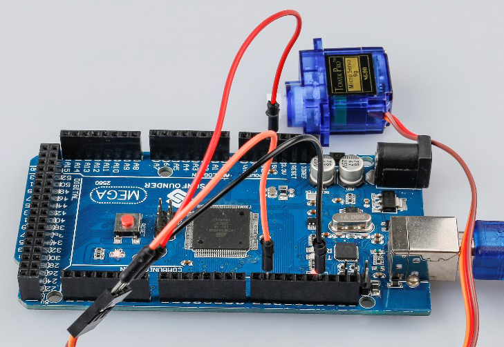

.. note::

    Hello, welcome to the SunFounder Raspberry Pi & Arduino & ESP32 Enthusiasts Community on Facebook! Dive deeper into Raspberry Pi, Arduino, and ESP32 with fellow enthusiasts.

    **Why Join?**

    - **Expert Support**: Solve post-sale issues and technical challenges with help from our community and team.
    - **Learn & Share**: Exchange tips and tutorials to enhance your skills.
    - **Exclusive Previews**: Get early access to new product announcements and sneak peeks.
    - **Special Discounts**: Enjoy exclusive discounts on our newest products.
    - **Festive Promotions and Giveaways**: Take part in giveaways and holiday promotions.

    👉 Ready to explore and create with us? Click [|link_sf_facebook|] and join today!

.. _servo_mega:

Lesson 10 Servo
==================

Introduction
-----------------

Servo is a type of geared motor that can only rotate 180 degrees. It is
controlled by sending electrical pulses from your board. These pulses
tell the servo what position it should move to.

A servo has three wires: the brown wire is GND, the red one is VCC, and
the orange one is signal line.

Components
---------------

* :ref:`SunFounder Mega Board`
* :ref:`Breadboard`
* :ref:`Jumper Wires`
* :ref:`Servo`

Schematic Diagram
--------------------------
The schematic diagram:

Experimental Procedures
----------------------------

**Step 1:** Build the circuit (Brown to GND, Red to VCC, Orange to pin 9
of the control board)

**Step 2:** Open the code file.

**Step 3:** Select the **Board** and **Port.**

**Step 4:** Upload the sketch to the board.

Now, you can see the rocker arm of the servo rotate and stop at 90
degrees (15 degrees each time). And then it rotates in the opposite
direction.

Code
--------

.. raw:: html

    <iframe src=https://create.arduino.cc/editor/sunfounder01/b6d44ce5-7d33-4728-bb53-36c7cf079573/preview?embed style="height:510px;width:100%;margin:10px 0" frameborder=0></iframe>

Code Analysis
-----------------

**Include a library**

.. code-block:: Arduino

    #include <Servo.h>

    Servo myservo; //create servo object to control a servo

With the ``Servo.h`` file included, you can call the functions in this
file later. Servo is a built-in library in the Arduino IDE. You can find
the Servo folder under the installation path *C:\Program
Files\Arduino\libraries*.

**Initialize the servo**

.. code-block:: Arduino

    void setup()

    {

        myservo.attach(9); //attachs the servo on pin 9 to servo object

        myservo.write(0); //back to 0 degrees

        delay(1000); //wait for a second

    }

**myservo.attach():** Attach the Servo variable to a pin. Initialize the
servo attach to pin9.

**myservo.write():** Writes a value to the servo, controlling the shaft
accordingly. On a standard servo, this will set the angle of the shaft
(in degrees), moving the shaft to that orientation. Here let the servo
stay in the 0 angle firstly.

**Servo rotate**

.. code-block:: Arduino

    void loop()

    {

        for (int i = 0; i <= 180; i++)

        {

            myservo.write(i); //write the i angle to the servo

            delay(15); //delay 15ms

        }

        for (int i = 180; i >= 0; i--)

        {

            myservo.write(i); //write the i angle to the servo

            delay(15); //delay 15ms

        }

    }

Use 2 for() statement to write 0 - 180 to the servo, so that you can see
the servo rotate from 0 to 180 angle,then turn back to 0.
