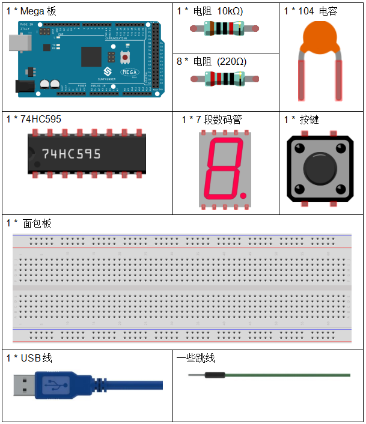
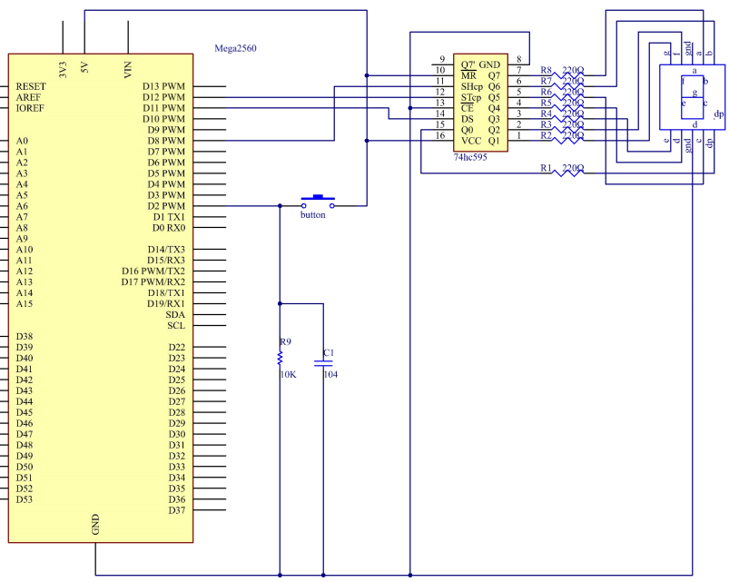
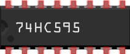
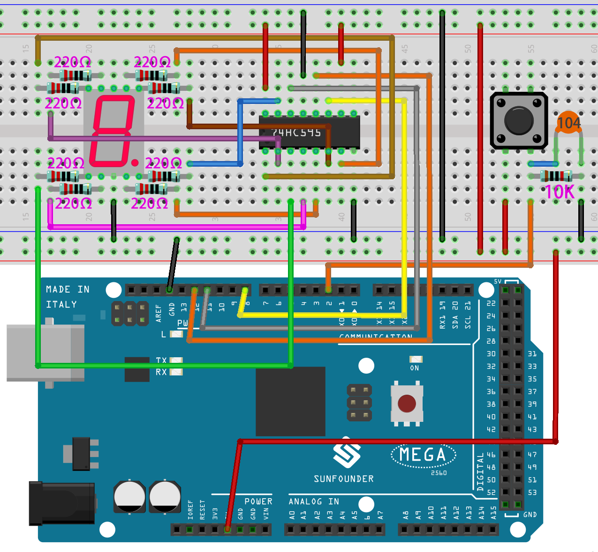
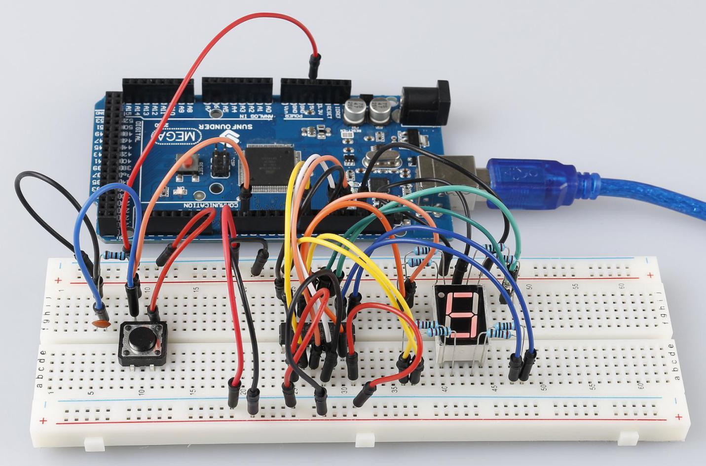

.. note::

    你好，欢迎来到 SunFounder 树莓派、Arduino 和 ESP32 爱好者社区的 Facebook 页面！与其他爱好者一起深入探讨树莓派、Arduino 和 ESP32。

    **为什么加入？**

    - **专家支持**: 通过我们的社区和团队的帮助解决售后问题和技术挑战。
    - **学习与分享**: 交流技巧和教程，提升你的技能。
    - **独家预览**: 提前了解新产品发布和预告。
    - **特别折扣**: 尊享我们最新产品的专属折扣。
    - **节日促销和赠品**: 参与赠品活动和节日促销。

    👉 准备好与我们一起探索和创造了吗？点击 [|link_sf_facebook|] 加入我们吧！

.. _digital_dice_mega:

第 23 课 简单创作 - 数字骰子
=========================================

介绍
------------------

在之前的实验中，我们学习了如何使用 7 段数码管并通过按键控制 LED。在本课中，我们将使用一个 7 段数码管和一个按键来创建一个简单的数字骰子。

所需器件
--------------

* :ref:`SunFounder Mega板`
* :ref:`面包板`
* :ref:`跳线`
* :ref:`电阻`
* :ref:`7段数码管`
* :ref:`74HC595`
* :ref:`按键`
* :ref:`电容`

原理图
-----------------------------

数字骰子背后的想法非常简单：一个 7 段数码管从 1 到 7 快速循环显示。当按下按键时，流动会减慢，
直到它停在一个数字上。当再次按下按键时，该过程将重复。

原理图如下所示：

实验步骤
------------------------------

**第 1 步**：搭建电路。

**第 2 步**：打开代码文件 ``Lesson_23_Digital_Dice.ino``。

**第 3 步**：选择 **开发板** 和 **端口**。

**第 4 步**：点击 **上传** 按钮来上传代码。

你现在可以看到7 段数码管循环显示1~6。按下按键，显示速度会减慢，直到三秒后停止。再次按下按键，该过程将重复。

代码
--------

.. raw:: html

   <iframe src=https://create.arduino.cc/editor/sunfounder01/01ff7967-7923-46ed-b1fb-8f817ca30659/preview?embed style="height:510px;width:100%;margin:10px 0" frameborder=0></iframe>

代码分析
--------------------

**初始随机数来自A0**

.. code-block:: arduino

   randomSeed(analogRead(0));

初始随机数是从 A0 生成的，随机数的范围是 0-1023。

**数字骰子**

.. code-block:: Arduino

    void loop()
    {
        int stat = digitalRead(keyIn);  //store value read from keyIn
        if(stat == HIGH)  // check if the pushbutton is pressed

如果是，相应的引脚为高电平。

.. code-block:: Arduino

    {
        num ++; // num adds 1
        if(num > 1) 
        {
            num = 0;
        }
    }

如果 num > 1，则清除该值。这是为了防止重复按压。所以不管你按多少次都算一次。

.. code-block:: Arduino

    Serial.println(num);  // print the num on serial monitor
    if(num == 1)  //when pushbutton is pressed
    {
        randNumber = random(1,7); //Generate a random number in 1-7
        showNum(randNumber);  //show the randNumber on 7-segment
        delay(1000);  //wait for 1 second   
        while(!digitalRead(keyIn));  //When not press button,program stop here. 

让它一直显示最后一个随机数。

.. code-block:: Arduino     

    int stat = digitalRead(keyIn); 

再次读取按键的状态。

.. code-block:: Arduino 

    if(stat == HIGH) // check if the pushbutton is pressed

如果是，请运行下面的代码。

.. code-block:: Arduino 

    {
            num ++; // num+1=2
            digitalWrite(ledPin,HIGH); //turn on the led
            delay(100);
            digitalWrite(ledPin,LOW); //turn off the led
            delay(100);
            if(num >= 1) // clear the num
            {
                num = 0;
            }
        }
        }
        //show random numbers at 100 microseconds intervals
        //If the button has not been pressed
        randNumber = random(1,7);
        showNum(randNumber);
        delay(100);
    }

**showNum() 函数**

.. code-block:: arduino

    void showNum(int num)
    {
        digitalWrite(latchPin,LOW); //ground latchPin and hold low for transmitting
        shiftOut(dataPin,clockPin,MSBFIRST,datArray[num]);
        //return the latch pin high to signal chip that it 
        //no longer needs to listen for information
        digitalWrite(latchPin,HIGH); //pull the latchPin to save the data
    }

该功能是在7段数码管上显示 ``dataArray[]`` 中的数字。