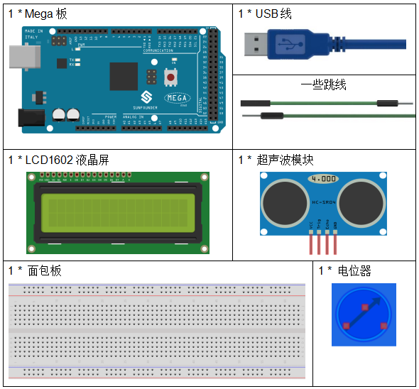
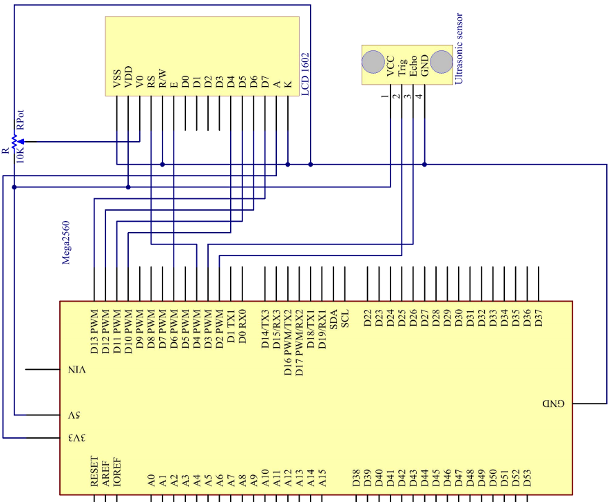
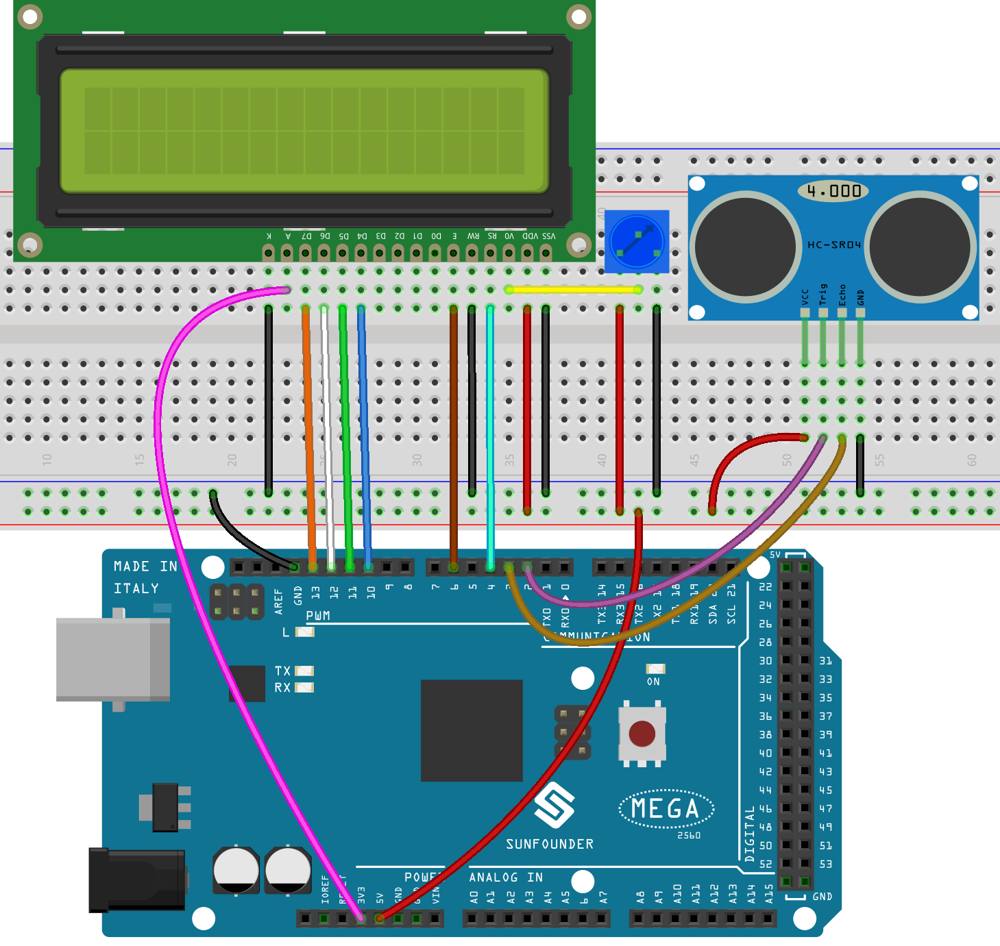
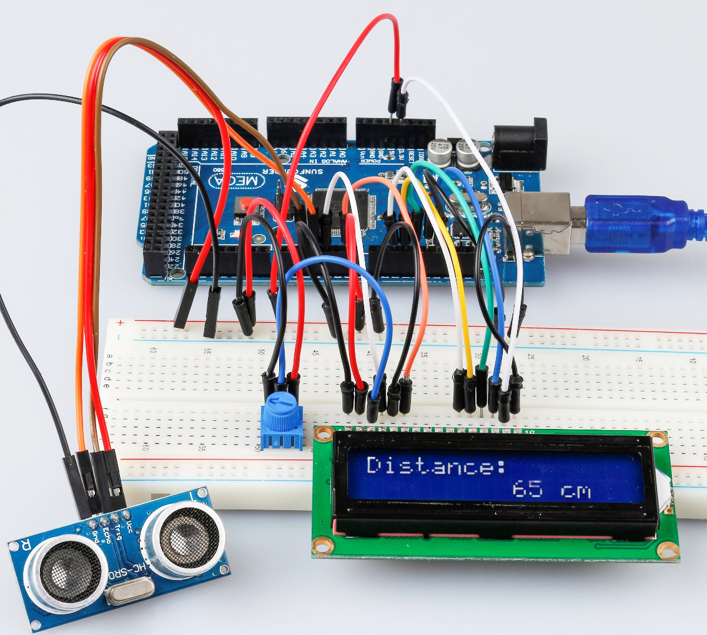

.. note::

    你好，欢迎来到 SunFounder 树莓派、Arduino 和 ESP32 爱好者社区的 Facebook 页面！与其他爱好者一起深入探讨树莓派、Arduino 和 ESP32。

    **为什么加入？**

    - **专家支持**: 通过我们的社区和团队的帮助解决售后问题和技术挑战。
    - **学习与分享**: 交流技巧和教程，提升你的技能。
    - **独家预览**: 提前了解新产品发布和预告。
    - **特别折扣**: 尊享我们最新产品的专属折扣。
    - **节日促销和赠品**: 参与赠品活动和节日促销。

    👉 准备好与我们一起探索和创造了吗？点击 [|link_sf_facebook|] 加入我们吧！

.. _ultrasonic_mega:

第 13 课 超声波
=====================

介绍
----------------

倒车时，你会看到汽车与周围障碍物之间的距离，以避免碰撞。检测距离的装置是超声波传感器。在本实验中，你将了解超声波如何检测距离。

所需器件
-------------

* :ref:`SunFounder Mega板`
* :ref:`面包板`
* :ref:`跳线`
* :ref:`电位器`
* :ref:`超声波模块`
* :ref:`LCD1602液晶显示屏`

原理图
--------------------------

原理图如下所示：

实验步骤
--------------------------

**第 1 步**：搭建电路。

**第 2 步**：打开代码文件 ``Lesson_13_Ultrasonic.ino``。

**第 3 步**：选择 **开发板** 和 **端口**。

**第 4 步**：点击 **上传** 按钮来上传代码。

.. note::

    如果出现如下错误，是因为你没有添加名为NewPing的库，请参考 :ref:`添加库`。

    .. image:: media_mega2560/image183.png

现在，如果你使用一张纸靠近或远离传感器。你会看到 LCD1602 上显示的值发生变化，这表示纸张与超声波传感器之间的距离。

代码
-----------------------

.. raw:: html

    <iframe src=https://create.arduino.cc/editor/sunfounder01/6bd4821b-3e3d-4ad2-8fb1-b72965ebea57/preview?embed style="height:510px;width:100%;margin:10px 0" frameborder=0></iframe>

代码分析
----------------

**初始化超声波和LCD1602**

.. code-block:: Arduino

    #include <LiquidCrystal.h>
    #include <NewPing.h>

    LiquidCrystal lcd(4, 6, 10, 11, 12, 13);//lcd(RS,E,D4,D5,D6,D7)

    #define TRIGGER_PIN  2  //  trig pin on the ultrasonic sensor attach to pin2 .
    #define ECHO_PIN     3  //  echo pin on the ultrasonic sensor attach to pin3.
    #define MAX_DISTANCE 400 // Maximum distance we want to ping for (in centimeters). Maximum sensor distance is rated at 400-500cm.

    NewPing sonar(TRIGGER_PIN, ECHO_PIN, MAX_DISTANCE); // NewPing setup of pins and maximum distance.

创建一个 ``NewPing`` 变量 ``sonar``。NewPing的基本格式为： ``NewPing(uint8_t trigger_pin, uint8_t echo_pin, int max_cm_distance)`` 。这里uint 表示无符号整数，8 表示 8 位。所以这里 uint8 格式的值意味着一个 unsigned-char 类型的值。

**将时间转换成距离**

.. code-block:: Arduino

    unsigned int uS = sonar.ping(); // Send ping, get ping time in
    microseconds (uS).

``ping()`` 用来计算从脉冲发送到接收的时间。定义一个变量 ``Us`` 来存储接收的时间，单位应该是微秒（us）。

.. code-block:: Arduino

    int distance = uS / US_ROUNDTRIP_CM;

``uS / US_ROUNDTRIP_CM `` 是将 ``ping()`` 发送和接收之间的时间转换为距离的公式，单位是厘米。

**在LCD1602上显示距离**

.. code-block:: Arduino

    lcd.setCursor(0, 0);//Place the cursor at Line 1, Column 1. From here the characters are to be displayed
    lcd.print("Distance:");////Print Distance: on the LCD
    lcd.setCursor(0, 1);//Set the cursor at Line 1, Column 0
    lcd.print("             ");//Here is to leave some spaces after the characters so as to clear the previous characters that may still remain.
    lcd.setCursor(9, 1);//Set the cursor at Line 1, Column 9.
    lcd.print(distance);// print on the LCD the value of the distance converted from the time between ping sending and receiving. 
    lcd.setCursor(12, 1);//Set the cursor at Line 1, Column 12.
    lcd.print("cm");//print the unit "cm"