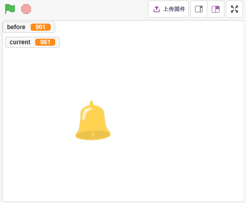
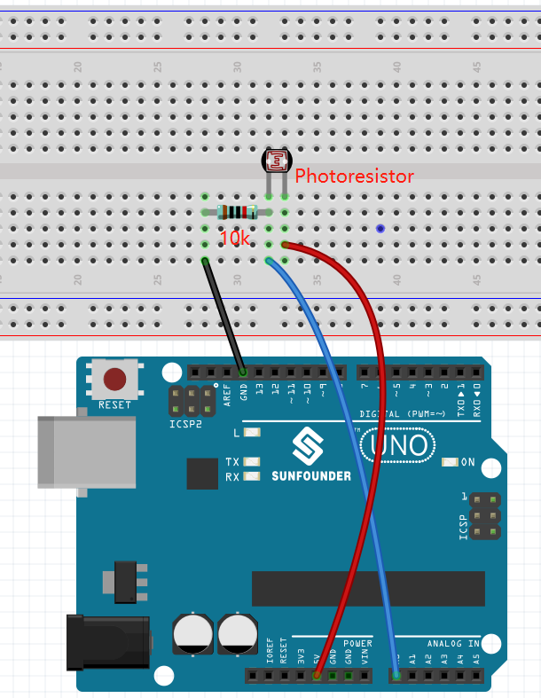
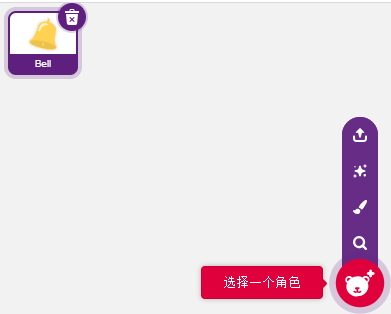
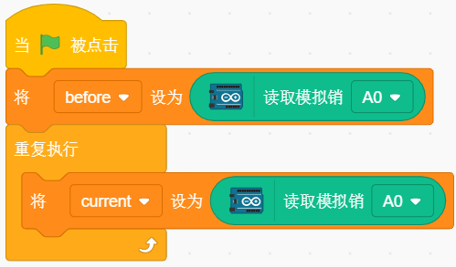
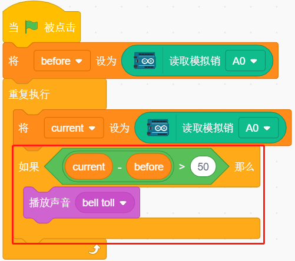
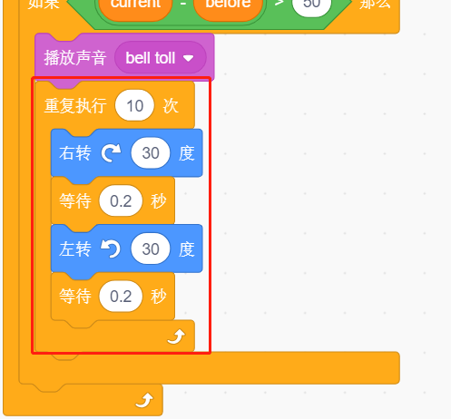
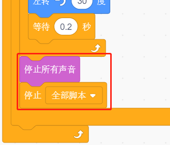

.. note::

    Hello, welcome to the SunFounder Raspberry Pi & Arduino & ESP32 Enthusiasts Community on Facebook! Dive deeper into Raspberry Pi, Arduino, and ESP32 with fellow enthusiasts.

    **Why Join?**

    - **Expert Support**: Solve post-sale issues and technical challenges with help from our community and team.
    - **Learn & Share**: Exchange tips and tutorials to enhance your skills.
    - **Exclusive Previews**: Get early access to new product announcements and sneak peeks.
    - **Special Discounts**: Enjoy exclusive discounts on our newest products.
    - **Festive Promotions and Giveaways**: Take part in giveaways and holiday promotions.

    👉 Ready to explore and create with us? Click [|link_sf_facebook|] and join today!

10. Light Alarm Clock
======================

In life, there are various kinds of time alarm clocks. Now let's make a light-controlled alarm clock. When morning comes, the brightness of light increases and this light-controlled alarm clock will remind you that it's time to get up.

You Will Learn
---------------------

- Photoresistor working principle
- Stopping sound playback and stopping scripts from running

Build the Circuit
-----------------------

A photoresistor or photocell is a light-controlled variable resistor. The resistance of a photoresistor decreases with increasing incident light intensity.

Build the circuit according to the following diagram.

Connect one end of the photoresistor to 5V, the other end to A0, and connect a 10K resistor in series with GND at this end.

So when the light intensity increases, the resistance of a photoresistor decreases, the voltage division of the 10K resistor increases, and the value obtained by A0 becomes larger.

* :ref:`Breadboard`
* :ref:`Photoresistor` 
* :ref:`Resistor`

Programming
------------------
**1. Select a sprite**

Delete the default sprite, click the **Choose a Sprite** button in the lower right corner of the sprite area, enter **bell** in the search box, and then click to add it.

**2. Read the value of A0**

Create two variables **before** and **current**. When green flag is clicked, read the value of A0 and store it in variable **before** as a reference value. In [forever], read the value of A0 again, store it in the variable **current**.

**3. Make a sound**

When the value of current A0 is greater than the previous 50, which represents the current light intensity is greater than the threshold, then let the sprite make a sound.

**4. Turning the sprite**

Use [turn block] to make the **bell** sprite turn left and right to achieve the alarm effect.

**5. stop all**

Stops the alarm when it has been ringing for a while.

