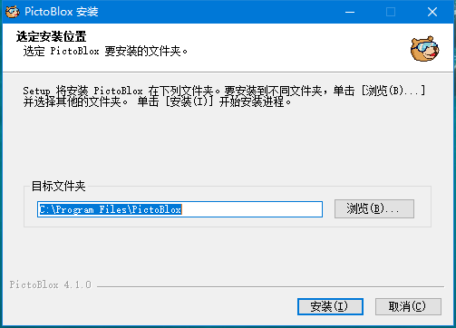
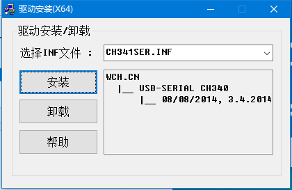
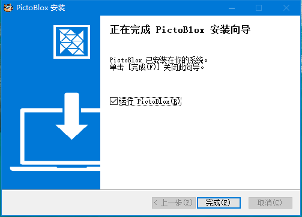
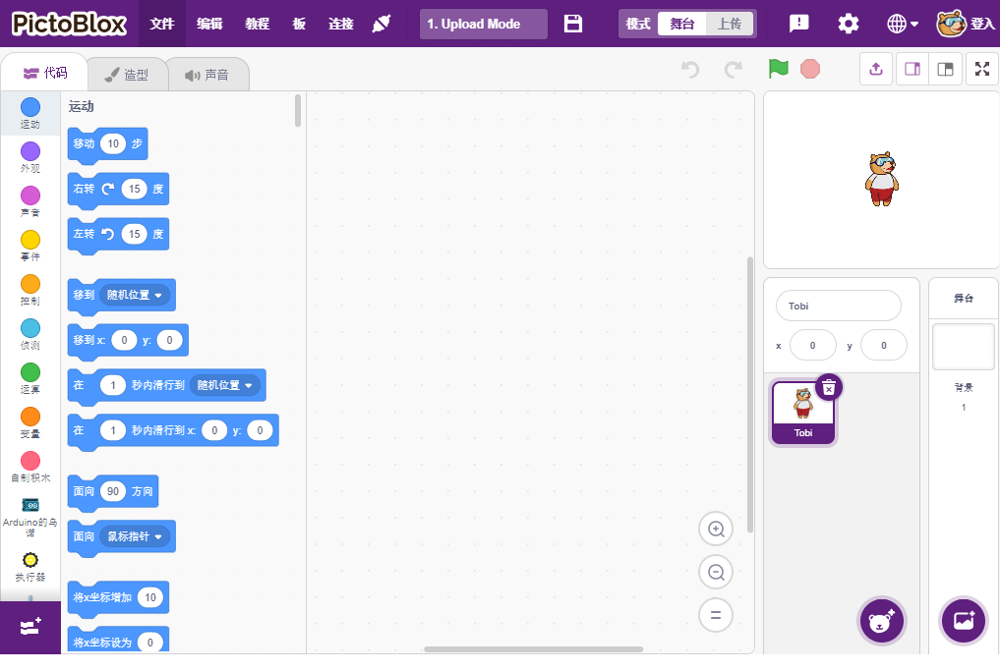
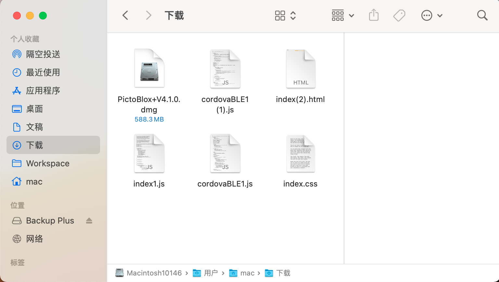
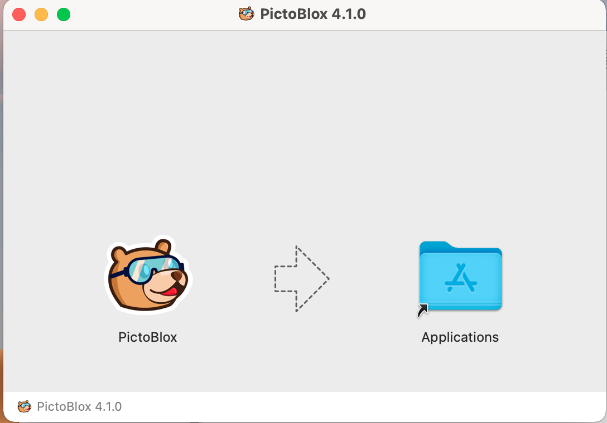

.. note::

    你好，欢迎来到 SunFounder 树莓派、Arduino 和 ESP32 爱好者社区的 Facebook 页面！与其他爱好者一起深入探讨树莓派、Arduino 和 ESP32。

    **为什么加入？**

    - **专家支持**: 通过我们的社区和团队的帮助解决售后问题和技术挑战。
    - **学习与分享**: 交流技巧和教程，提升你的技能。
    - **独家预览**: 提前了解新产品发布和预告。
    - **特别折扣**: 尊享我们最新产品的专属折扣。
    - **节日促销和赠品**: 参与赠品活动和节日促销。

    👉 准备好与我们一起探索和创造了吗？点击 [|link_sf_facebook|] 加入我们吧！

安装PictoBlox
===============================

根据你的系统来选择安装指示：

* :ref:`Windows`
* :ref:`macOS`

Windows
--------------------------

参考章节 :ref:`下载资料` 来下载相关的资料，然后进入到 ``SunFounder Uno R3学习套件\编程软件\PictoBlox\Windows`` 路径中，在这个文件夹中包含了32位和64位的安装包，请根据你的系统来选择。

双击下载的.exe文件，将会出现让你选择安装路径的窗口，然后点击 **安装**。

等待安装进行。

.. image:: img/win_install1.png

安装相应的驱动，过一段时间后将会提示”驱动预安装成功“。

点击 **完成** 来关闭安装向导。

此时PictoBlox将被打开，你可以根据它的使用向导来简单了解下PictoBlox的使用。

macOS
---------------

参考章节 :ref:`下载资料` 来下载相关的资料，然后进入到 ``SunFounder Uno R3学习套件\编程软件\PictoBlox\macOS`` 路径中，双击 ``.dmg`` 文件。

将它拖到 **Application（应用程序）** 文件夹。

现在你将在应用程序文件夹看到PictoBlox。

.. image:: img/mac_install3.png

双击来将它打开，会有提示想要访问摄像头和麦克风，看你自己选择是否允许。打开PictoBlox后，你可以根据它的使用向导来简单了解下PictoBlox的使用。

