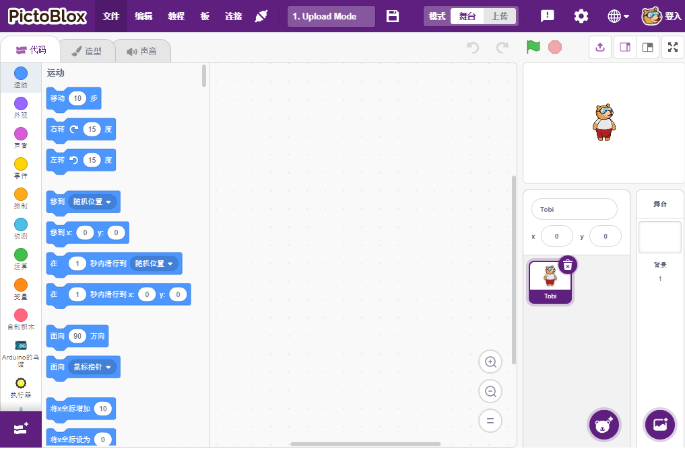

.. note::

    你好，欢迎来到 SunFounder 树莓派、Arduino 和 ESP32 爱好者社区的 Facebook 页面！与其他爱好者一起深入探讨树莓派、Arduino 和 ESP32。

    **为什么加入？**

    - **专家支持**: 通过我们的社区和团队的帮助解决售后问题和技术挑战。
    - **学习与分享**: 交流技巧和教程，提升你的技能。
    - **独家预览**: 提前了解新产品发布和预告。
    - **特别折扣**: 尊享我们最新产品的专属折扣。
    - **节日促销和赠品**: 参与赠品活动和节日促销。

    👉 准备好与我们一起探索和创造了吗？点击 [|link_sf_facebook|] 加入我们吧！

Scratch项目
========================

除了用Uno/Mega2560板在Arduino IDE上进行编程，我们还可以用它们来进行图形化编程。

这里我们推荐使用Scratch进行编程，但官方的Scratch目前只兼容树莓派，所以我们合作了一家公司, `STEMPedia <https://thestempedia.com/>`_, 他们研发了一款适用于Arduino板子（Uno， Mega2560和Nano）的基于Scratch 3的图形化编程软件- `PictoBlox <https://thestempedia.com/product/pictoblox/>`_.

它保留了Scratch 3的基本功能，还加入了其他的主控板，比如Arduino Uno, Mega，Nano，ESP32，Microbit及STEAMPedia自制的主控板，可以用外接的传感器，机器人来控制舞台上的精灵，具有很强的硬件交互功能。

除此之外，它还有AI和机器学习，即使你没有太多的编程基础，你也可以学习和使用这些流行和高新技术。

只需拖放 Scratch 编码块，即可制作酷炫的游戏、动画、互动项目，甚至以你想要的方式控制机器人！

现在让我们开始探索旅程吧！

.. toctree::
    :maxdepth: 1
    
    install
    introduce
    projects
    

    

    

