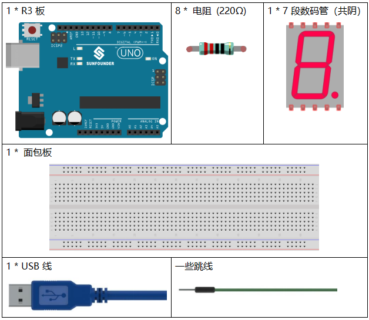
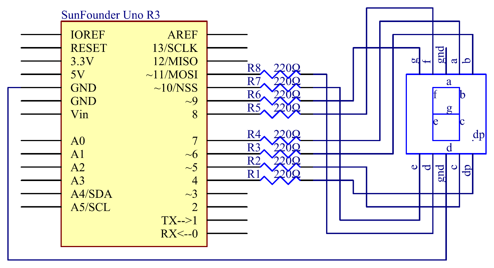
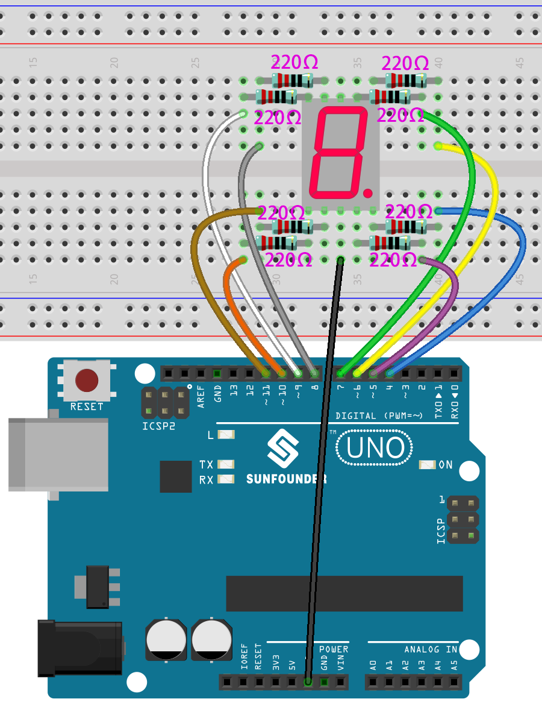
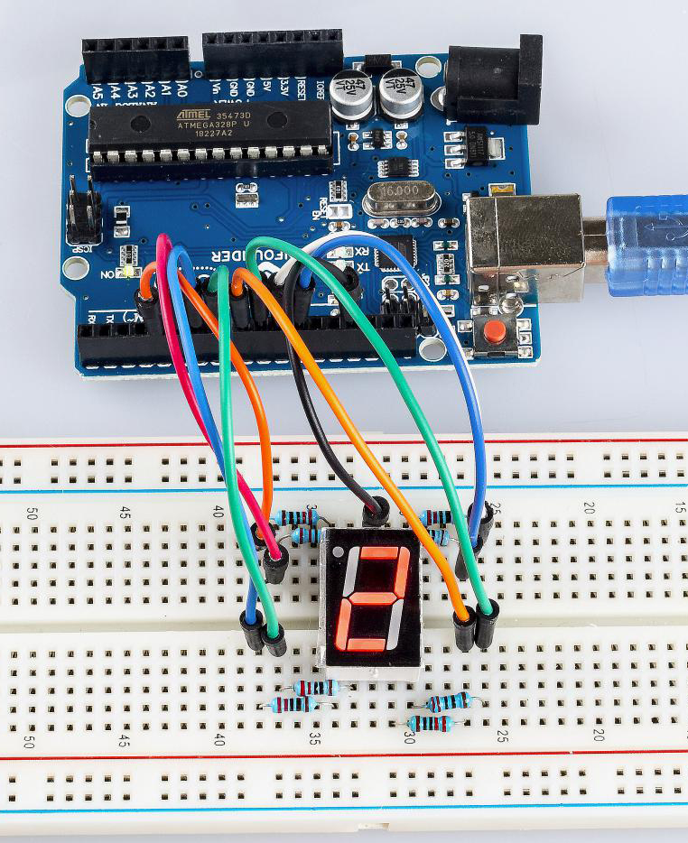

.. note::

    你好，欢迎来到 SunFounder 树莓派、Arduino 和 ESP32 爱好者社区的 Facebook 页面！与其他爱好者一起深入探讨树莓派、Arduino 和 ESP32。

    **为什么加入？**

    - **专家支持**: 通过我们的社区和团队的帮助解决售后问题和技术挑战。
    - **学习与分享**: 交流技巧和教程，提升你的技能。
    - **独家预览**: 提前了解新产品发布和预告。
    - **特别折扣**: 尊享我们最新产品的专属折扣。
    - **节日促销和赠品**: 参与赠品活动和节日促销。

    👉 准备好与我们一起探索和创造了吗？点击 [|link_sf_facebook|] 加入我们吧！

.. _7segmeng_uno:

第 17 课 7段数码管
===============================

介绍
---------------------

7段数码管是一种可以显示数字和字母的设备。它由七个并联的 LED 组成。通过将数码管上的引脚连接到电源并启用相关引脚，从而打开相应的 LED 段，可以显示不同的字母/数字。在本课中，我们将学习如何在其上显示特定字符​​。

所需器件
----------------

* :ref:`SunFounder R3板`
* :ref:`面包板`
* :ref:`跳线`
* :ref:`电阻`
* :ref:`7段数码管`

原理图
------------------------

在本实验中，将7段数码管的每个引脚 a~g 分别连接到一个 220 欧姆的限流电阻，然后连接到引脚 4-11。GND 连接到 GND。通过编程，我们可以将pin4-11中的一个或几个设置为高电平来点亮相应的LED。

实验步骤
-------------------------

**第 1 步**：搭建电路 (这里使用的是共阴极7段数码管）。

7段数码管与R3板的接线：

========= =========
7-Segment R3板
a         7
b         6
c         5
d         11
e         10
f         8
g         9
dp        4
“ - “     GND
========= =========

**第 2 步**：打开代码文件 ``Lesson_17_7_Segment_Display.ino``。

**第 3 步**：选择 **开发板** 和 **端口**。

**第 4 步**：点击 **上传** 按钮来上传代码。

你现在应该看到 7 段数码管轮流显示0-9，A-F。

代码
---------

.. raw:: html

   <iframe src=https://create.arduino.cc/editor/sunfounder01/9382b0e5-cec6-481d-abea-bed912587a42/preview?embed style="height:510px;width:100%;margin:10px 0" frameborder=0></iframe>

代码分析
----------------------

这个实验的代码可能有点长。但是语法很简单。让我们来看看。

**在 loop() 中调用函数**

.. code-block:: arduino

    void loop()
    {
        digital_1();//diaplay 1 to the 7-segment
        delay(1000);//wait for a second
        digital_2();//diaplay 2 to the 7-segment
        delay(1000); //wait for a second
        digital_3();//diaplay 3 to the 7-segment
        delay(1000); //wait for a second
        digital_4();//diaplay 4 to the 7-segment
    ...

将这些函数调用到loop()中是为了让7段数码管显示0-F。功能如下所示。以 ``digital_2()`` 为例：

**digital_2()详解**

.. code-block:: arduino

    void digital_2(void) //diaplay 2 to the 7-segment
    {
    digitalWrite(b,HIGH);
    digitalWrite(a,HIGH);
    for(int j = 9;j <= 11;j++)
        digitalWrite(j,HIGH);
    digitalWrite(c,LOW);
    digitalWrite(f,LOW);
    }

.. image:: media_uno/image161.jpeg
   :align: center

首先我们需要知道 在7段数码管上显示数字2时的样子。实际上是 a、b、d、e 和 g 段通电（被设置为高电平），c 和 f 熄灭（被设置为高电平），从而产生2的显示。

运行此部分后，7 段数码管将显示2。同样，其他字符的显示也是一样的。由于大写字母 b 和 d ，即B和D，在数码管上与8 和0看起来相同，因此它们以小写字母显示。