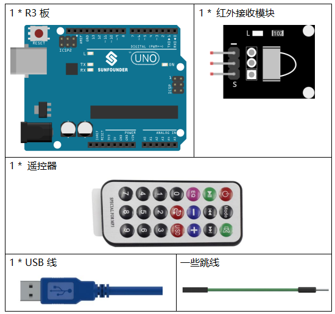
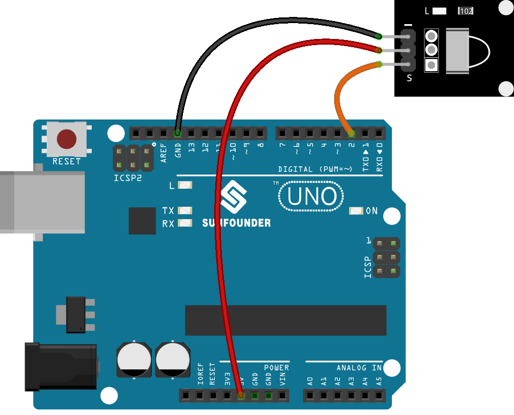
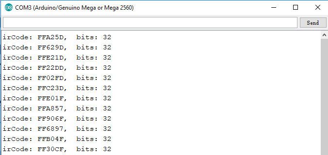
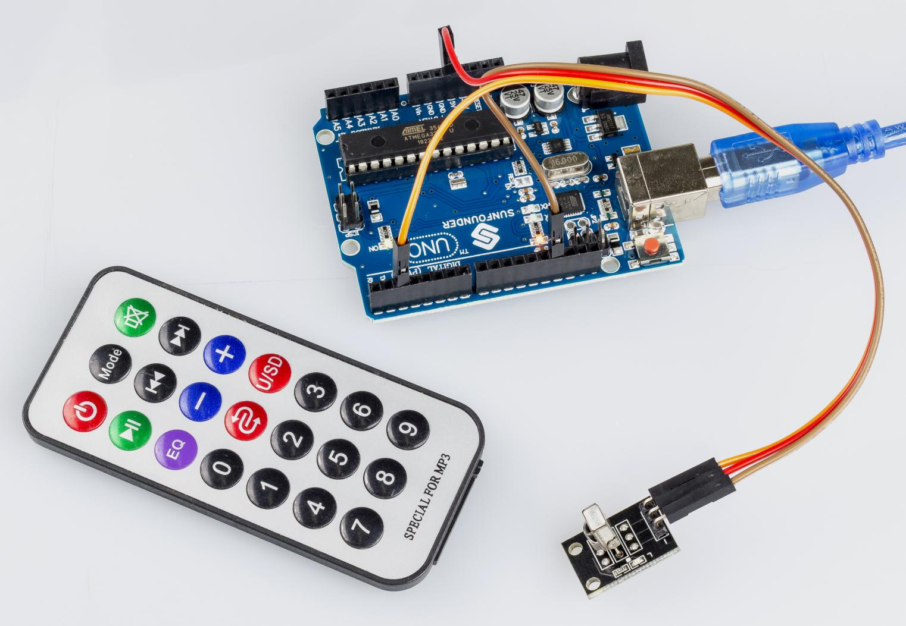

.. note::

    你好，欢迎来到 SunFounder 树莓派、Arduino 和 ESP32 爱好者社区的 Facebook 页面！与其他爱好者一起深入探讨树莓派、Arduino 和 ESP32。

    **为什么加入？**

    - **专家支持**: 通过我们的社区和团队的帮助解决售后问题和技术挑战。
    - **学习与分享**: 交流技巧和教程，提升你的技能。
    - **独家预览**: 提前了解新产品发布和预告。
    - **特别折扣**: 尊享我们最新产品的专属折扣。
    - **节日促销和赠品**: 参与赠品活动和节日促销。

    👉 准备好与我们一起探索和创造了吗？点击 [|link_sf_facebook|] 加入我们吧！

.. _receive_uno:

第 14 课 红外接收模块
============================

介绍
-------------------

红外接收器是接收红外信号并能独立接收红外线并输出兼容TTL电平的信号的部件。它的尺寸与普通的塑料封装晶体管相似，适用于各种红外遥控和红外传输。

所需器件
----------------

* :ref:`SunFounder R3板`
* :ref:`面包板`
* :ref:`跳线`
* :ref:`红外接收模块`

原理图
---------------------

通过编程读取遥控上的某个键的键值（例如，电源键）。当你按下该键时，红外线会从遥控器发出并被红外线接收器接收，控制板上的 LED 会亮起。

原理图如下所示：

.. image:: media_uno/image140.png
    :align: center

实验步骤
------------------------------

**第 1 步**：搭建电路。.

**第 2 步**：打开代码文件 ``Lesson_14_Infrared_Receiver.ino``。

**第 3 步**：选择 **开发板** 和 **端口**。

**第 4 步**：点击 **上传** 按钮来上传代码。

现在，按下遥控器上的电源，控制板上连接到引脚 13 的 LED 将亮起。如果按其他键，LED 将熄灭。

.. note::

  * 遥控器的尾部有一块透明塑料片用来切断电源，你需要在使用前拔出。
  * 请轻轻按下遥控器上的按钮，以避免无效数据FFFFFFFF。

代码 
-------

.. raw:: html

    <iframe src=https://create.arduino.cc/editor/sunfounder01/42ad3e60-0233-4b65-b930-971a4f744527/preview?embed style="height:510px;width:100%;margin:10px 0" frameborder=0></iframe>

代码分析
-----------------

**初始化红外接收器**

.. code-block:: Arduino

    #include <IRremote.h>
    const int irReceiverPin = 2; // the infrared-receiver attact to pin2
    const int ledPin = 13; // built-in LED
    IRrecv irrecv(irReceiverPin); // Initialize the infrared-receiver
    decode_results results; // The decoding result is placed in the result of the decode results structure.

**启用红外接收器**

.. code-block:: Arduino

    irrecv.enableIRIn(); // Restart the receiver

**接收并打印数据**

.. code-block:: Arduino

    if (irrecv.decode(&results)) { // If receive a data

``decode(&results)``：对接收到的红外信息进行解码，没有数据返回0，否则返回1。解码结果存放在 ``results`` 中。

.. code-block:: Arduino

        Serial.print("irCode: "); // print "irCode: " on the serial monitor
        Serial.print(results.value, HEX); // print the signal on serial monitor
        in hexadecimal
        Serial.print(", bits: ");
        Serial.println(results.bits); // Print the data bits
        irrecv.resume(); // Receive next data
    }
    delay(600);

**如果电源键被按下**

.. code-block:: Arduino

    if(results.value == 0xFFA25D) // if the power button on the remote control is pressed

``0xFFA25D`` 是遥控器电源键的代码，如果你想定义其他按钮，你可以从串口监视器上读取每个按键的代码。

.. code-block:: Arduino

    {
        digitalWrite(ledPin,HIGH); // Turn on the LED
    }
    else
    {
        digitalWrite(ledPin,LOW); // else turn of the LED
    }