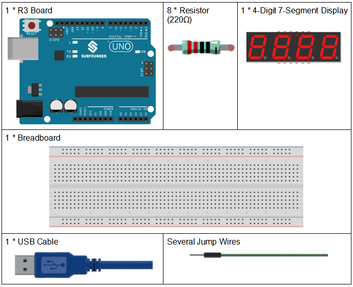
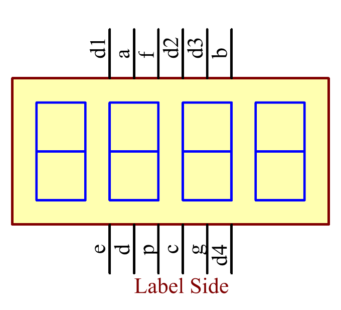
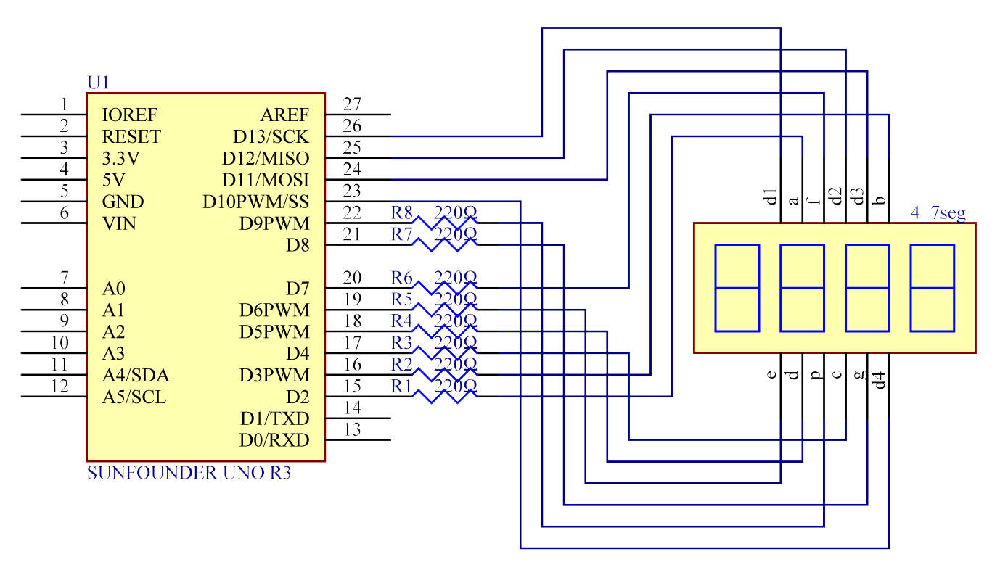
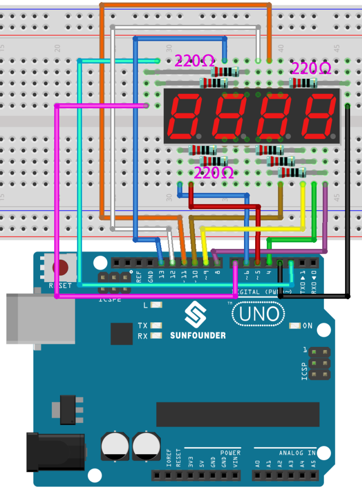
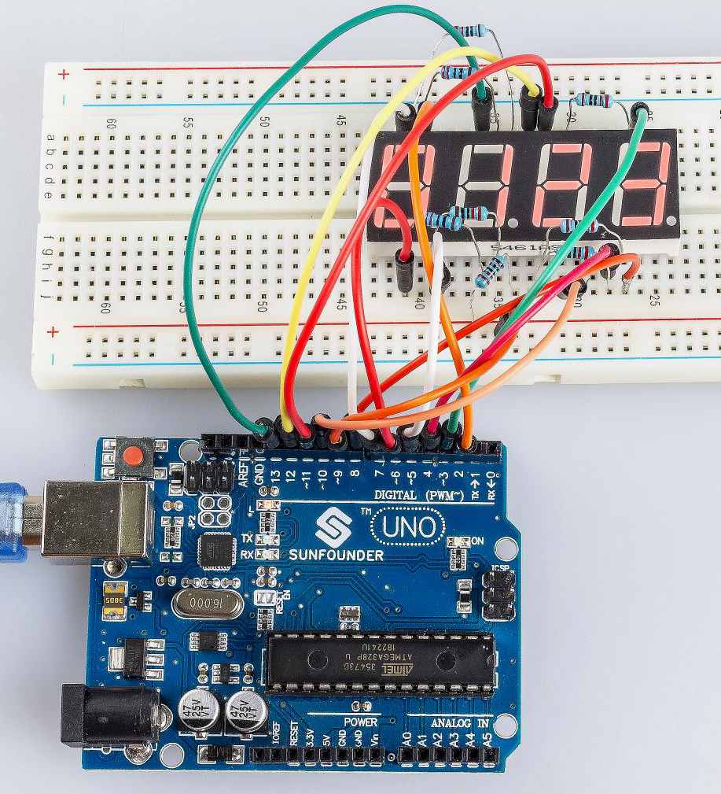

.. note::

    你好，欢迎来到 SunFounder 树莓派、Arduino 和 ESP32 爱好者社区的 Facebook 页面！与其他爱好者一起深入探讨树莓派、Arduino 和 ESP32。

    **为什么加入？**

    - **专家支持**: 通过我们的社区和团队的帮助解决售后问题和技术挑战。
    - **学习与分享**: 交流技巧和教程，提升你的技能。
    - **独家预览**: 提前了解新产品发布和预告。
    - **特别折扣**: 尊享我们最新产品的专属折扣。
    - **节日促销和赠品**: 参与赠品活动和节日促销。

    👉 准备好与我们一起探索和创造了吗？点击 [|link_sf_facebook|] 加入我们吧！

.. _stopwatch_uno:

第 20 课 简单创作 - 秒表
=====================================

介绍
-----------------------

在这个课程中，我们将使用4位7段数码管来制作一个秒表。

所需器件
-----------------

* :ref:`SunFounder R3板`
* :ref:`面包板`
* :ref:`跳线`
* :ref:`电阻`
* :ref:`4 位 7 段数码管`

原理图
-------------------------

使用7段数码管时，如果是共阳极数码管，将阳极引脚接电源；如果是共阴极，则将阴极引脚连接到GND。使用4位7段数码管时，共阳极或共阴极管脚控制显示的数字。只有一位数字有效，但是，根据视觉暂留原理，我们可以看到四个7段数码管都显示数字。这是因为电子扫描速度太快，我们无法注意到间隔。

4位7段数码管示意图如下：

原理图如下所示：

实验步骤
-----------------------------------

**第 1 步**：搭建电路。.

========================= =========
4位7段数码管                R3板
a                         2
b                         3
c                         4
d                         5
e                         6
f                         7
g                         8
p                         9
D1                        13
D2                        12
D3                        11
D4                        10
========================= =========

   

**第 2 步**：打开代码文件 ``Lesson_20_Stopwatch.ino``。

**第 3 步**：选择 **开发板** 和 **端口**。

**第 4 步**：点击 **上传** 按钮来上传代码。

现在，你可以在 4 位 7 段数码管上看到数字每秒增加 1。

代码
--------

.. raw:: html

    <iframe src=https://create.arduino.cc/editor/sunfounder01/f3d5a253-7941-40f1-a475-5a90871f06dc/preview?embed style="height:510px;width:100%;margin:10px 0" frameborder=0></iframe>

代码分析
-------------------

这就是代码的全部内容，比较长，我总结一下：

将4位7段数码管的所有引脚设置为输出。设置定时器1为0.1秒，所以当0.1秒的时候， ``add()`` 
会被调用；但是在0.1秒过去之前， ``add()`` 还没有被调用。然后运行 ``loop()`` 函数，4个数码管显示
为0000。等待一段时间，0.1秒后，表明count=10，调用函数 ``add()``。然后n++=1；因为1<10000，
不会恢复到0。运行 ``loop()``，数码管显示为0001。0.1秒后，n增加1，n++=2，显示将变成0002，
然后是0003，一直到9999。n每秒增加1，显示的数字也相应增加，直到n=10000，n再次为0。
然后从0开始计数。

**初始化定时器**

.. code-block:: Arduino

    Timer1.initialize(100000); 
    // set a timer of length 100000 microseconds(or 0.1 sec - or 10Hz => the led will blink 5 times, 5 cycles of on-and-off, per second)

    Timer1.attachInterrupt( add ); // attach the service routine here

语句 ``attachInterrupt(add)`` 就是附加一个ISR函数，当有中断时调用 ``add()`` 函数。

**Loop函数**

.. code-block:: Arduino

    void loop()
    {
        clearLEDs();//clear the 7-segment display screen
        pickDigit(0);//Light up 7-segment display d1
        pickNumber((n / 1000)); // get the value of thousand
        delay(del);//delay 5ms

        clearLEDs();//clear the  7-segment display screen
        pickDigit(1);//Light up 7-segment display d2
        pickNumber((n % 1000) / 100); // get the value of hundred
        delay(del);//delay 5ms

        clearLEDs();//clear the  7-segment display screen
        pickDigit(2);//Light up 7-segment display d3
        pickNumber(n % 100 / 10); //get the value of ten
        delay(del);//delay 5ms

        clearLEDs();//clear the 7-segment display screen
        pickDigit(3);//Light up 7-segment display d4
        pickNumber(n % 10); //Get the value of single digit
        delay(del);//delay 5ms
    }

``loop()`` 用于让四段显示器显示一个数值的个位数、十位、十万位。

如n=1345、(1345/1000)=1、(1345%1000)/100)=3、((1345%100)/10)=4、(n%10)=5

**pickDigit(int x) 函数**

.. code-block:: Arduino

    void pickDigit(int x)  //light up a 7-segment display
    {
        //The 7-segment LED display is a common-cathode one. So also use digitalWrite to set d1 as high and the LED will go out
        digitalWrite(d1, HIGH);
        digitalWrite(d2, HIGH);
        digitalWrite(d3, HIGH);
        digitalWrite(d4, HIGH);

        switch (x)
        {
            case 0:
                digitalWrite(d1, LOW);//Light d1 up
                break;
            case 1:
                digitalWrite(d2, LOW); //Light d2 up
                break;
            case 2:
                digitalWrite(d3, LOW); //Light d3 up
                break;
            default:
                digitalWrite(d4, LOW); //Light d4 up
                break;
        }
    }

4位7段数码管为共阴的，将d1、d2、d3、d4全部设置为HIGH使其熄灭。

再来判断x的值：

* x为0，让d1为低电平来让第4个数码管（左边第一个）工作。
* x为1， 让第3个数码管工作。
* x为2，让第2个数码管工作。
* 默认情况下，让第1个数码管（右边第一个）工作。

**pickNumber(int x)函数**

.. code-block:: Arduino

    void pickNumber(int x)
    {
        switch (x)
        {
            default:
                zero();
                break;
            case 1:
                one();
                break;
            case 2:
                two();
                break;
            case 3:
                three();
                break;
            ...

这个函数的功能是控制LED显示数字。调用 ``zero()``、 ``one()`` 直到 ``nine()`` 函数显示 0-9 数字。

通过 x的值来判断显示什么数字：

* 默认情况，调用 ``zero()`` 函数来显示0。
* x为1，调用 ``one()`` 函数来显示1。
* x为2，调用 ``two()`` 函数来显示2。
* x为3，调用 ``three()`` 函数来显示3。
* x为4，调用 ``four()`` 函数来显示4。
* x为5，调用 ``five()`` 函数来显示5。
* x为6，调用 ``six()`` 函数来显示6。
* x为7，调用 ``seven()`` 函数来显示7。
* x为8，调用 ``eight()`` 函数来显示8。
* x为9，调用 ``nine()`` 函数来显示9。

以 ``zero()`` 为例：

``zero()`` 函数是控制 LED 的高低电平。使用 ``digitalWrite()`` 将 a 设置为 f 为高，g 为低。根据刚才提到的引脚图，当a到f为高，g为低时，会显示数字0。

.. code-block:: Arduino

    void zero() //the  7-segment led display 0
    {
        digitalWrite(a, HIGH);
        digitalWrite(b, HIGH);
        digitalWrite(c, HIGH);
        digitalWrite(d, HIGH);
        digitalWrite(e, HIGH);
        digitalWrite(f, HIGH);
        digitalWrite(g, LOW);
    }

**clearLEDs() 函数**

.. code-block:: Arduino

    void clearLEDs() //clear the  7-segment display screen
    {
        digitalWrite(a, LOW);
        digitalWrite(b, LOW);
        digitalWrite(c, LOW);
        digitalWrite(d, LOW);
        digitalWrite(e, LOW);
        digitalWrite(f, LOW);
        digitalWrite(g, LOW);
        digitalWrite(p, LOW);
    }

将a-p引脚都设置为低电平来让4位7段数码管全部熄灭。

**add()函数**

.. code-block:: Arduino

    void add()
    {
        // Toggle LED
        count ++;
        if(count == 10)
        {
        count = 0;
        n ++;
        if(n == 10000)
        {
            n = 0;
        }
        }
    }

``count`` 的初始值是0，将 ``count`` 累加；加到10再重置为0，此时将 ``n`` 累加； ``n`` 加到10000后，再重置为0。
