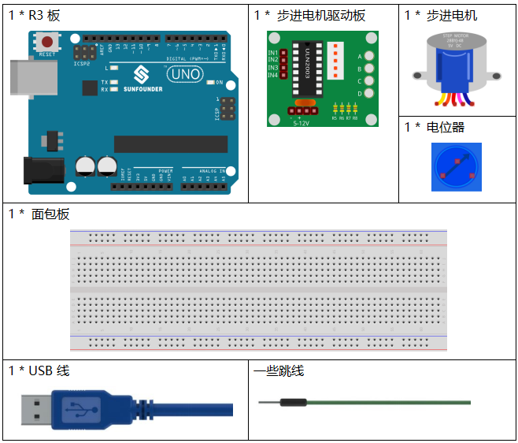
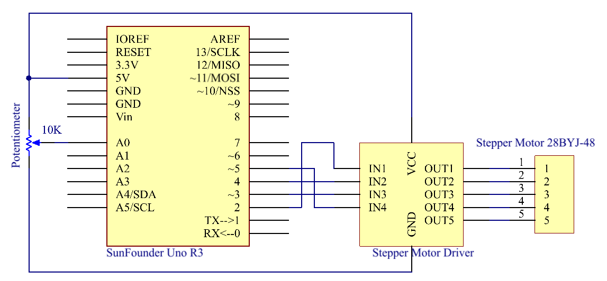
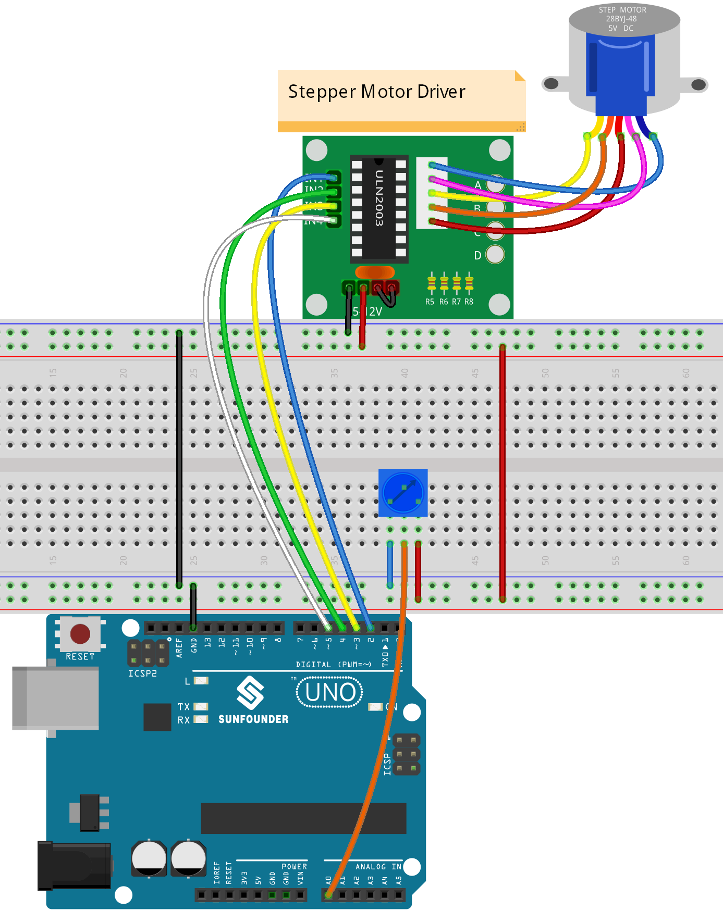
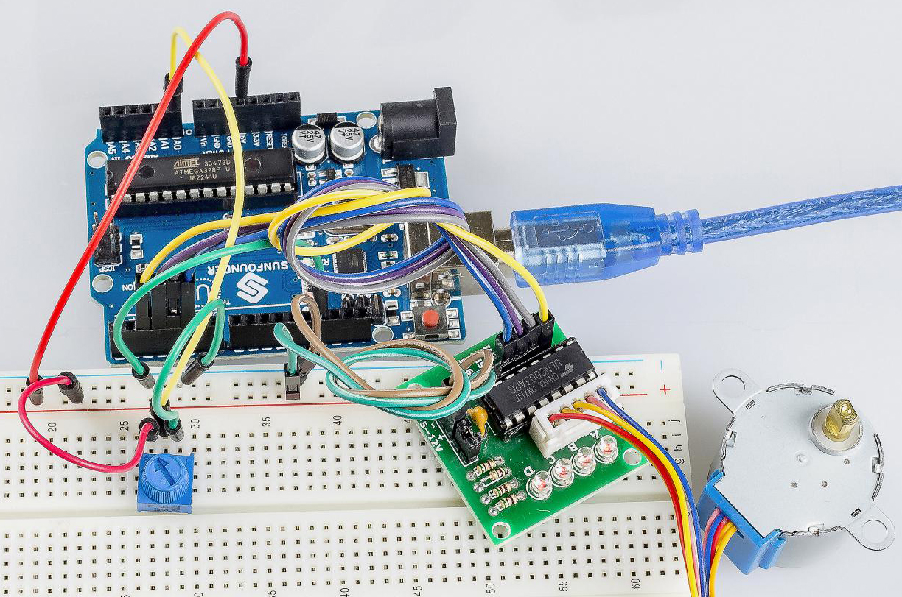

.. note::

    你好，欢迎来到 SunFounder 树莓派、Arduino 和 ESP32 爱好者社区的 Facebook 页面！与其他爱好者一起深入探讨树莓派、Arduino 和 ESP32。

    **为什么加入？**

    - **专家支持**: 通过我们的社区和团队的帮助解决售后问题和技术挑战。
    - **学习与分享**: 交流技巧和教程，提升你的技能。
    - **独家预览**: 提前了解新产品发布和预告。
    - **特别折扣**: 尊享我们最新产品的专属折扣。
    - **节日促销和赠品**: 参与赠品活动和节日促销。

    👉 准备好与我们一起探索和创造了吗？点击 [|link_sf_facebook|] 加入我们吧！

.. _stepper_uno:

第 19 课 步进电机
=========================

介绍
--------------------

步进电机由于其独特的设计，可以在没有任何反馈机制的情况下进行高精度控制。步进电机的轴上装有一系列磁铁，由一系列电磁线圈控制，这些线圈按特定顺序带正负电，以小“步”精确地向前或向后移动。

所需器件
-------------

* :ref:`SunFounder R3板`
* :ref:`面包板`
* :ref:`跳线`
* :ref:`电位器`
* :ref:`步进电机`

原理图
---------------------

原理图如下所示：

实验步骤
---------------------------

**第 1 步**：搭建电路。

==================== ===
步进电机驱动板         R3板
IN1                  2
IN2                  4
IN3                  3
IN4                  5
GND                  GND
VCC                  5v
==================== ===

**第 2 步**：打开代码文件 ``Lesson_19_Stepper_Motor.ino``。

**第 3 步**：选择 **开发板** 和 **端口**。

**第 4 步**：点击 **上传** 按钮来上传代码。

现在，你应该看到步进电机的摇臂顺时针和逆时针交替旋转。

代码
--------

.. raw:: html

   <iframe src=https://create.arduino.cc/editor/sunfounder01/2e8012d2-0d5d-4b38-b63e-f0b792ed10b1/preview?embed style="height:510px;width:100%;margin:10px 0" frameborder=0></iframe>

代码分析
-----------------

**初始化步进电机**

.. code-block:: Arduino

    #include <Stepper.h> //include a head file
    //the steps of a circle
    #define STEPS 2048
    //set steps and the connection with MCU
    Stepper stepper(STEPS, 2, 3, 4, 5);
    //available to store previous value
    int previous = 0;

包含头文件 ``Stepper.h``，将步长设置为 100，然后使用函数 ``stepper()`` 初始化步进电机。

* ``Stepper(steps, pin1, pin2, pin3, pin4)``：此函数创建 ``Stepper`` 类的新实例，代表连接到 Arduino 板的特定步进电机。
* ``steps``：电机旋转一圈的步数。如果你的电机给出每步的度数，将该数字除以 360 以获得步数（例如 360 / 3.6 给出 100 步，整数型）。

**setSpeed()函数**

.. code-block:: Arduino

    //speed of per minute
    stepper.setSpeed(15); //set the motor speed in rotations per minute(RPMs)

* ``setSpeed(rpms)``：以每分钟转数 (RPMs) 为单位设置电机速度。此函数不会使电机转动，只是设置调用 ``step()`` 时的速度。
* ``rpms``：电机每分钟旋转的速度 - 一个正数（长型）。

**主程序**

.. code-block:: Arduino

    void loop()
    { 
    //get analog value
    int val = analogRead(0); //Read the value of the potentiometer
    //current reading minus the reading of history
    stepper.step(val - previous); //Turn the motor in val-previous steps
    //store as prevous value
    previous = val; //the value of potentiometer assignment to variable previous
    }

主程序是先读取A0的值，然后根据A0的值来设置步进电机转动的步数。

* ``step(steps)``：以特定的步数转动电机，速度由最近调用 ``setSpeed()`` 确定。这个功能是阻塞的；也就是说，它将等到电机完成移动后才能将控制权传递给代码中的下一行。例如，如果你将速度设置为 1 RPM 并在 100 步电机上调用 ``step(100)``，则此函数将需要整整一分钟才能运行。为了更好地控制，保持高速并且每次调用 ``step()`` 时只走几步。
* ``steps``：转动电机的步数 - 正向转动一个方向，负向转动另一个（int）。
