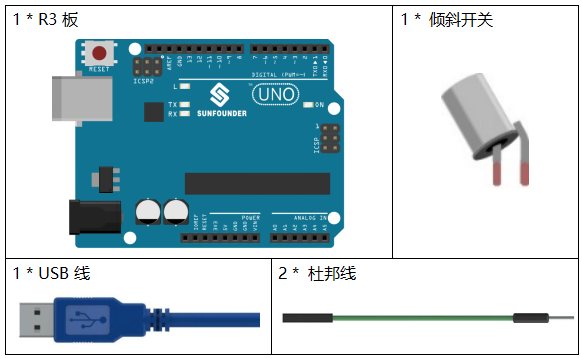
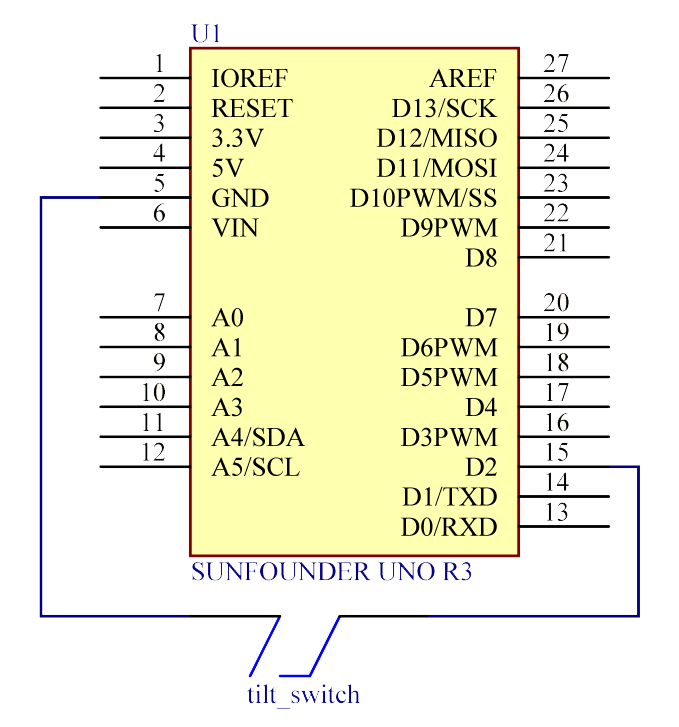
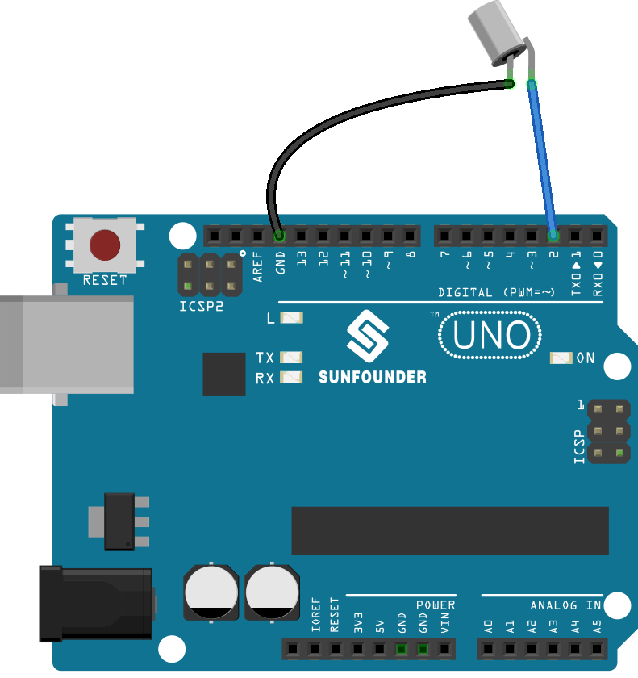
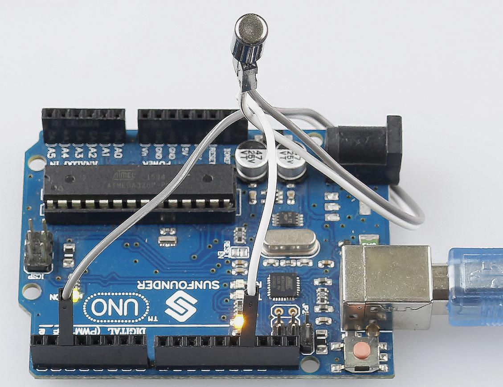

.. note::

    你好，欢迎来到 SunFounder 树莓派、Arduino 和 ESP32 爱好者社区的 Facebook 页面！与其他爱好者一起深入探讨树莓派、Arduino 和 ESP32。

    **为什么加入？**

    - **专家支持**: 通过我们的社区和团队的帮助解决售后问题和技术挑战。
    - **学习与分享**: 交流技巧和教程，提升你的技能。
    - **独家预览**: 提前了解新产品发布和预告。
    - **特别折扣**: 尊享我们最新产品的专属折扣。
    - **节日促销和赠品**: 参与赠品活动和节日促销。

    👉 准备好与我们一起探索和创造了吗？点击 [|link_sf_facebook|] 加入我们吧！

.. _tilt_uno:

第 5 课 倾斜开关
========================

介绍
----------------

这里用的倾斜开关是内部有一个金属球，用来检测小角度的倾斜值。

所需器件
--------------

* :ref:`SunFounder R3板`
* :ref:`面包板`
* :ref:`跳线`
* :ref:`倾斜开关`

原理图
---------------------

实验步骤
-----------------------------

**第 1 步**：搭建电路。.

**第 2 步**：打开代码文件 ``Lesson_5_Tilt_Switch.ino``。

**第 3 步**：选择 **开发板** 和 **端口**。

**第 4 步**：点击 **上传** 按钮来上传代码。

现在，将开关倾斜，控制板上的LED将会被点亮。

代码
--------

.. raw:: html

   <iframe src=https://create.arduino.cc/editor/sunfounder01/b836688d-452c-4c43-a5d3-d8cc6c163b2a/preview?embed style="height:510px;width:100%;margin:10px 0" frameborder=0></iframe>

整个代码很简单，倾斜开关的一个脚接pin2，另一脚接GND，当倾斜开关时，开关的两个脚接GND，然后让pin13上的LED点亮。
